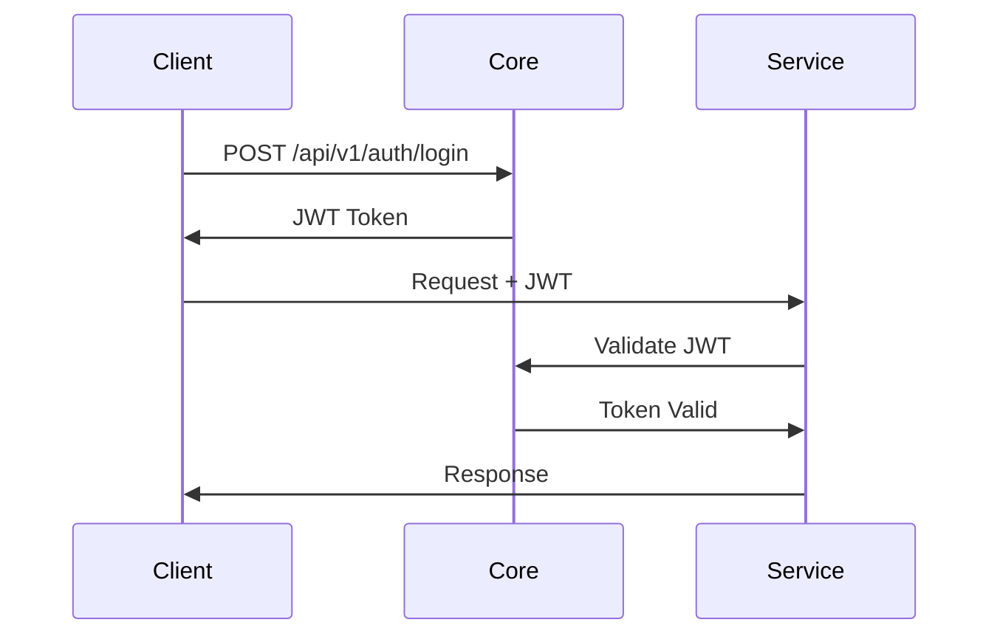
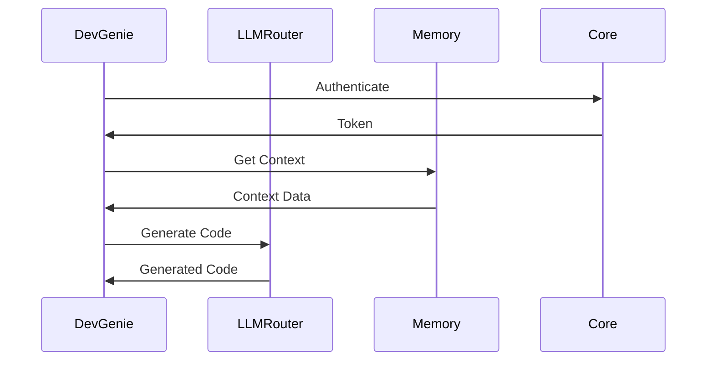

# Codessa Platform Dependency Mapping

## Overview
This document provides a comprehensive mapping of dependencies between all Codessa Platform services, enabling proper deployment ordering, impact analysis, and architectural decision-making.

## Dependency Hierarchy

### Tier 0: External Dependencies
```yaml
External Services:
  - Database Systems: PostgreSQL, Redis, Vector DBs
  - Message Queues: RabbitMQ, Apache Kafka
  - Cloud Providers: AWS, GCP, Azure
  - Authentication: OAuth providers, LDAP
  - Monitoring: Prometheus, Grafana, ELK Stack
```

### Tier 1: Foundation Services (No Internal Dependencies)

#### codessa-core
```yaml
Service: codessa-core
Type: Foundation Service
Internal Dependencies: []
External Dependencies:
  - PostgreSQL (configuration storage)
  - Redis (caching)
  - OAuth Provider (authentication)
Provides:
  - Authentication APIs
  - Configuration management
  - Core utilities
  - Health monitoring
Consumers:
  - ALL other services
```

#### skyforge
```yaml
Service: skyforge
Type: Infrastructure Service
Internal Dependencies: [codessa-core]
External Dependencies:
  - Cloud Provider APIs (AWS/GCP/Azure)
  - Terraform
  - Ansible
  - Kubernetes
Provides:
  - Infrastructure automation
  - Deployment orchestration
  - Resource management
Consumers:
  - All services (for deployment)
```

### Tier 2: Data & Security Services

#### codessa-memory
```yaml
Service: codessa-memory
Type: Data Management Service
Internal Dependencies:
  - codessa-core (authentication, config)
External Dependencies:
  - Vector Database (Pinecone/Weaviate/Chroma)
  - PostgreSQL (metadata)
  - Redis (caching)
Provides:
  - Memory storage APIs
  - Vector operations
  - Context management
Consumers:
  - codessa-llm-router
  - codessa-metamind
  - devgenie
  - echoforge
  - echopilot
```

#### gitguard
```yaml
Service: gitguard
Type: Security Service
Internal Dependencies:
  - codessa-core (authentication, config)
External Dependencies:
  - Git repositories
  - Security scanning tools
  - Compliance databases
Provides:
  - Security analysis APIs
  - Compliance checking
  - Vulnerability detection
Consumers:
  - devgenie (code security)
  - pondskipperhq (security dashboard)
  - CI/CD pipelines
```

### Tier 3: Intelligence Services

#### codessa-llm-router
```yaml
Service: codessa-llm-router
Type: AI Orchestration Service
Internal Dependencies:
  - codessa-core (authentication, config)
  - codessa-memory (context, embeddings)
External Dependencies:
  - OpenAI API
  - Anthropic API
  - Google AI API
  - Local LLM endpoints
Provides:
  - LLM routing APIs
  - Model selection
  - Load balancing
  - Cost optimization
Consumers:
  - codessa-metamind
  - devgenie
  - echoforge
  - echopilot
  - docfoundry
```

#### codessa-metamind
```yaml
Service: codessa-metamind
Type: Meta-Intelligence Service
Internal Dependencies:
  - codessa-core (authentication, config)
  - codessa-memory (context, reasoning history)
  - codessa-llm-router (LLM access)
External Dependencies:
  - Specialized AI models
  - Knowledge graphs
Provides:
  - Meta-reasoning APIs
  - Strategy selection
  - Cross-domain intelligence
Consumers:
  - echoforge (agent coordination)
  - devgenie (intelligent assistance)
  - pondskipperhq (system optimization)
```

### Tier 4: Application Services

#### devgenie
```yaml
Service: devgenie
Type: Development Assistant
Internal Dependencies:
  - codessa-core (authentication, config)
  - codessa-llm-router (AI capabilities)
  - codessa-memory (code context)
  - gitguard (security analysis)
External Dependencies:
  - IDE integrations
  - Code repositories
  - Package managers
Provides:
  - Code generation APIs
  - Analysis services
  - Refactoring tools
Consumers:
  - echopilot (development UI)
  - pondskipperhq (development metrics)
  - External IDEs
```

#### echoforge
```yaml
Service: echoforge
Type: Multi-Agent Framework
Internal Dependencies:
  - codessa-core (authentication, config)
  - codessa-llm-router (agent intelligence)
  - codessa-memory (agent memory)
  - codessa-metamind (coordination intelligence)
External Dependencies:
  - Workflow engines
  - Message queues
Provides:
  - Agent orchestration APIs
  - Workflow management
  - Multi-agent coordination
Consumers:
  - echopilot (agent interfaces)
  - pondskipperhq (agent monitoring)
  - External applications
```

#### docfoundry
```yaml
Service: docfoundry
Type: Documentation Service
Internal Dependencies:
  - codessa-core (authentication, config)
  - codessa-llm-router (content generation)
  - devgenie (code analysis)
External Dependencies:
  - Documentation platforms
  - Static site generators
  - Search engines
Provides:
  - Documentation generation APIs
  - Knowledge management
  - Content organization
Consumers:
  - pondskipperhq (documentation dashboard)
  - External documentation sites
```

### Tier 5: Interface Services

#### echopilot
```yaml
Service: echopilot
Type: User Interface Service
Internal Dependencies:
  - codessa-core (authentication, config)
  - echoforge (agent interactions)
  - devgenie (development features)
  - codessa-llm-router (direct AI access)
External Dependencies:
  - Web browsers
  - Mobile platforms
Provides:
  - User interfaces
  - Chat interfaces
  - Interactive experiences
Consumers:
  - End users
  - External applications
```

#### pondskipperhq
```yaml
Service: pondskipperhq
Type: Management Dashboard
Internal Dependencies:
  - codessa-core (authentication, config)
  - codessa-memory (system memory)
  - codessa-llm-router (AI insights)
  - codessa-metamind (system intelligence)
  - devgenie (development metrics)
  - echoforge (agent status)
  - gitguard (security status)
  - docfoundry (documentation status)
  - echopilot (user metrics)
  - skyforge (infrastructure status)
External Dependencies:
  - Monitoring systems
  - Analytics platforms
Provides:
  - Management interfaces
  - System monitoring
  - Analytics dashboards
Consumers:
  - System administrators
  - DevOps teams
  - Business stakeholders
```

## Dependency Matrix

| Service | Core | Memory | LLM-Router | MetaMind | DevGenie | EchoForge | GitGuard | DocFoundry | EchoPilot | PondSkipper | SkyForge |
|---------|------|--------|------------|----------|----------|-----------|----------|------------|-----------|-------------|----------|
| codessa-core | - | ❌ | ❌ | ❌ | ❌ | ❌ | ❌ | ❌ | ❌ | ❌ | ❌ |
| codessa-memory | ✅ | - | ❌ | ❌ | ❌ | ❌ | ❌ | ❌ | ❌ | ❌ | ❌ |
| codessa-llm-router | ✅ | ✅ | - | ❌ | ❌ | ❌ | ❌ | ❌ | ❌ | ❌ | ❌ |
| codessa-metamind | ✅ | ✅ | ✅ | - | ❌ | ❌ | ❌ | ❌ | ❌ | ❌ | ❌ |
| devgenie | ✅ | ✅ | ✅ | ❌ | - | ❌ | ✅ | ❌ | ❌ | ❌ | ❌ |
| echoforge | ✅ | ✅ | ✅ | ✅ | ❌ | - | ❌ | ❌ | ❌ | ❌ | ❌ |
| gitguard | ✅ | ❌ | ❌ | ❌ | ❌ | ❌ | - | ❌ | ❌ | ❌ | ❌ |
| docfoundry | ✅ | ❌ | ✅ | ❌ | ✅ | ❌ | ❌ | - | ❌ | ❌ | ❌ |
| echopilot | ✅ | ❌ | ✅ | ❌ | ✅ | ✅ | ❌ | ❌ | - | ❌ | ❌ |
| pondskipperhq | ✅ | ✅ | ✅ | ✅ | ✅ | ✅ | ✅ | ✅ | ✅ | - | ✅ |
| skyforge | ✅ | ❌ | ❌ | ❌ | ❌ | ❌ | ❌ | ❌ | ❌ | ❌ | - |

**Legend:**
- ✅ Direct dependency
- ❌ No dependency
- `-` Self reference

## Deployment Order

### Sequential Deployment Strategy

```yaml
Deployment Phases:
  Phase 1 - Foundation:
    - codessa-core
    - skyforge
  
  Phase 2 - Data & Security:
    - codessa-memory
    - gitguard
  
  Phase 3 - Intelligence:
    - codessa-llm-router
    - codessa-metamind
  
  Phase 4 - Applications:
    - devgenie
    - echoforge
    - docfoundry
  
  Phase 5 - Interfaces:
    - echopilot
    - pondskipperhq
```

### Parallel Deployment Opportunities

```yaml
Parallel Groups:
  Group 1 (Independent):
    - codessa-core
    - skyforge
  
  Group 2 (Depends on Group 1):
    - codessa-memory
    - gitguard
  
  Group 3 (Depends on Groups 1-2):
    - codessa-llm-router
  
  Group 4 (Depends on Groups 1-3):
    - codessa-metamind
  
  Group 5 (Depends on Groups 1-4):
    - devgenie
    - echoforge (partial)
    - docfoundry
  
  Group 6 (Depends on Groups 1-5):
    - echoforge (full)
    - echopilot
  
  Group 7 (Depends on all):
    - pondskipperhq
```

## API Dependencies

### Core API Contracts

#### Authentication Flow


#### Service Communication


### Critical API Endpoints

#### codessa-core
```yaml
Critical Endpoints:
  - POST /api/v1/auth/login
  - POST /api/v1/auth/validate
  - GET /api/v1/config/{service}
  - GET /api/v1/health
  - POST /api/v1/events
```

#### codessa-memory
```yaml
Critical Endpoints:
  - POST /api/v1/memory/store
  - GET /api/v1/memory/retrieve
  - POST /api/v1/vectors/search
  - GET /api/v1/context/{session}
```

#### codessa-llm-router
```yaml
Critical Endpoints:
  - POST /api/v1/llm/complete
  - POST /api/v1/llm/chat
  - GET /api/v1/models/available
  - POST /api/v1/routing/optimize
```

## Failure Impact Analysis

### Service Failure Impact

#### codessa-core Failure
```yaml
Impact: CRITICAL - Complete system failure
Affected Services: ALL
Recovery Priority: HIGHEST
Mitigation:
  - Multi-instance deployment
  - Database replication
  - Circuit breakers
```

#### codessa-memory Failure
```yaml
Impact: HIGH - AI services degraded
Affected Services:
  - codessa-llm-router (context loss)
  - codessa-metamind (reasoning degraded)
  - devgenie (context-aware features)
  - echoforge (agent memory)
Mitigation:
  - Distributed storage
  - Backup memory services
  - Graceful degradation
```

#### codessa-llm-router Failure
```yaml
Impact: HIGH - AI features unavailable
Affected Services:
  - codessa-metamind
  - devgenie
  - echoforge
  - echopilot
  - docfoundry
Mitigation:
  - Multiple LLM providers
  - Failover mechanisms
  - Local model fallbacks
```

#### pondskipperhq Failure
```yaml
Impact: MEDIUM - Management unavailable
Affected Services: None (monitoring only)
Mitigation:
  - Alternative monitoring
  - Direct service access
  - Backup dashboards
```

## Dependency Management

### Version Compatibility Matrix

```yaml
Compatibility Requirements:
  codessa-core:
    - API Version: v1.x
    - Breaking Changes: Major version only
  
  codessa-memory:
    - Requires: codessa-core >= 1.0.0
    - API Version: v1.x
  
  codessa-llm-router:
    - Requires: codessa-core >= 1.0.0, codessa-memory >= 1.0.0
    - API Version: v1.x
```

### Backward Compatibility

```yaml
Compatibility Strategy:
  - API versioning (v1, v2, etc.)
  - Graceful deprecation (6-month notice)
  - Feature flags for new functionality
  - Comprehensive testing matrix
```

## Monitoring Dependencies

### Health Check Dependencies

```yaml
Health Check Chain:
  codessa-core:
    - Database connectivity
    - Redis connectivity
    - External auth provider
  
  codessa-memory:
    - codessa-core health
    - Vector database connectivity
    - Storage availability
  
  codessa-llm-router:
    - codessa-core health
    - codessa-memory health
    - LLM provider availability
```

### Dependency Alerts

```yaml
Alert Conditions:
  - Service dependency timeout (>5s)
  - Dependency health check failure
  - Cascade failure detection
  - Performance degradation
```

## Development Dependencies

### Shared Libraries

```yaml
Shared Components:
  @codessa/core-client:
    - Authentication helpers
    - API client utilities
    - Common types
  
  @codessa/monitoring:
    - Health check utilities
    - Metrics collection
    - Logging standards
  
  @codessa/testing:
    - Test utilities
    - Mock services
    - Integration helpers
```

### Development Environment

```yaml
Local Development:
  - Docker Compose for service orchestration
  - Service mocking for isolated development
  - Dependency injection for testing
  - Hot reloading with dependency awareness
```

## Conclusion

This dependency mapping provides a comprehensive view of service relationships within the Codessa Platform. It enables:

1. **Proper deployment sequencing**
2. **Impact analysis for changes**
3. **Failure recovery planning**
4. **Performance optimization**
5. **Development workflow optimization**

Regular updates to this mapping are essential as the platform evolves and new services are added or existing dependencies change.