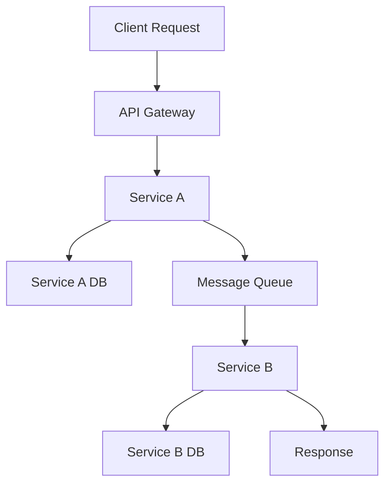

# Codessa Platform Modular Architecture Design

## Overview
This document outlines the modular architecture design for the Codessa Platform, transforming the monolithic structure into independent, scalable subsystems that can be developed, deployed, and maintained separately.

## Architecture Principles

### 1. Separation of Concerns
- Each project serves a specific domain responsibility
- Clear boundaries between business logic and infrastructure
- Minimal coupling between modules

### 2. Independent Deployment
- Each subsystem can be deployed independently
- Version management per project
- Rolling updates without system-wide downtime

### 3. Scalable Communication
- API-first design for inter-service communication
- Event-driven architecture for loose coupling
- Standardized protocols (REST, GraphQL, gRPC)

## Core Subsystems Architecture

### Tier 1: Foundation Layer

#### 1. **codessa-core** - Platform Foundation
```
Repository: codessa-platform/codessa-core
Type: Core Infrastructure Service
Dependencies: None (foundational)
Exposes: Core APIs, Authentication, Configuration
```

**Responsibilities:**
- Authentication and authorization
- Core configuration management
- Base API framework
- Shared utilities and libraries
- Health monitoring endpoints

**API Endpoints:**
- `/api/v1/auth/*` - Authentication services
- `/api/v1/config/*` - Configuration management
- `/api/v1/health` - Health checks

#### 2. **codessa-memory** - Memory Management
```
Repository: codessa-platform/codessa-memory
Type: Data Management Service
Dependencies: codessa-core
Exposes: Memory APIs, Vector Storage, Context Management
```

**Responsibilities:**
- Vector database management
- Context storage and retrieval
- Memory optimization
- Data persistence strategies

**API Endpoints:**
- `/api/v1/memory/*` - Memory operations
- `/api/v1/vectors/*` - Vector storage
- `/api/v1/context/*` - Context management

### Tier 2: Intelligence Layer

#### 3. **codessa-llm-router** - LLM Orchestration
```
Repository: codessa-platform/codessa-llm-router
Type: AI Service Orchestrator
Dependencies: codessa-core, codessa-memory
Exposes: LLM APIs, Model Selection, Load Balancing
```

**Responsibilities:**
- Multi-provider LLM integration
- Intelligent model selection
- Load balancing and failover
- Cost optimization

**API Endpoints:**
- `/api/v1/llm/*` - LLM operations
- `/api/v1/models/*` - Model management
- `/api/v1/routing/*` - Request routing

#### 4. **codessa-metamind** - Meta-Intelligence
```
Repository: codessa-platform/codessa-metamind
Type: Meta-AI Service
Dependencies: codessa-core, codessa-memory, codessa-llm-router
Exposes: Meta-reasoning, Strategy Selection
```

**Responsibilities:**
- Meta-reasoning capabilities
- Strategy selection and optimization
- Cross-domain intelligence coordination

### Tier 3: Application Layer

#### 5. **devgenie** - Development Assistant
```
Repository: codessa-platform/devgenie
Type: Developer Tool Service
Dependencies: codessa-core, codessa-llm-router, codessa-memory
Exposes: Code Generation, Analysis, Refactoring APIs
```

**Responsibilities:**
- AI-powered code generation
- Code analysis and refactoring
- Development workflow automation
- IDE integrations

#### 6. **echoforge** - Multi-Agent Framework
```
Repository: codessa-platform/echoforge
Type: Agent Orchestration Service
Dependencies: codessa-core, codessa-llm-router, codessa-memory
Exposes: Agent APIs, Workflow Management
```

**Responsibilities:**
- Multi-agent system coordination
- Workflow orchestration
- Agent lifecycle management
- Communication protocols

### Tier 4: Interface Layer

#### 7. **pondskipperhq** - Command & Control
```
Repository: codessa-platform/pondskipperhq
Type: Management Dashboard
Dependencies: All core services
Exposes: Web UI, Management APIs, Monitoring
```

**Responsibilities:**
- Unified management dashboard
- Real-time monitoring and alerts
- System configuration interface
- Performance analytics

#### 8. **echopilot** - User Interface
```
Repository: codessa-platform/echopilot
Type: User Interface Service
Dependencies: codessa-core, echoforge, devgenie
Exposes: Web UI, Chat Interface
```

**Responsibilities:**
- User interaction interfaces
- Chat and conversation management
- UI/UX for end users

### Tier 5: Specialized Services

#### 9. **gitguard** - Security & Compliance
```
Repository: codessa-platform/gitguard
Type: Security Service
Dependencies: codessa-core
Exposes: Security APIs, Compliance Checks
```

**Responsibilities:**
- Code security analysis
- Compliance monitoring
- Vulnerability detection
- Security policy enforcement

#### 10. **docfoundry** - Documentation
```
Repository: codessa-platform/docfoundry
Type: Documentation Service
Dependencies: codessa-core, devgenie
Exposes: Documentation APIs, Generation Tools
```

**Responsibilities:**
- Automated documentation generation
- Knowledge base management
- API documentation
- Content organization

#### 11. **skyforge** - Infrastructure
```
Repository: codessa-platform/skyforge
Type: Infrastructure Service
Dependencies: codessa-core
Exposes: Infrastructure APIs, Deployment Tools
```

**Responsibilities:**
- Infrastructure automation
- Deployment orchestration
- Resource management
- Cloud provider integration

## Inter-Service Communication

### Communication Patterns

1. **Synchronous Communication**
   - REST APIs for request-response patterns
   - GraphQL for complex data queries
   - gRPC for high-performance internal communication

2. **Asynchronous Communication**
   - Event-driven messaging for loose coupling
   - Message queues for reliable delivery
   - Pub/Sub patterns for broadcast scenarios

### API Standards

```yaml
API Design Standards:
  - RESTful principles
  - OpenAPI 3.0 specifications
  - Consistent error handling
  - Standardized authentication
  - Rate limiting and throttling
  - Comprehensive logging
```

### Service Discovery

```yaml
Service Registry:
  - Centralized service discovery
  - Health check integration
  - Load balancer configuration
  - Failover mechanisms
```

## Deployment Architecture

### Container Strategy

```dockerfile
# Standard Dockerfile template for each service
FROM node:18-alpine
WORKDIR /app
COPY package*.json ./
RUN npm ci --only=production
COPY . .
EXPOSE 3000
HEALTHCHECK --interval=30s --timeout=3s --start-period=5s --retries=3 \
  CMD curl -f http://localhost:3000/health || exit 1
CMD ["npm", "start"]
```

### Kubernetes Deployment

```yaml
# Standard deployment template
apiVersion: apps/v1
kind: Deployment
metadata:
  name: service-name
spec:
  replicas: 3
  selector:
    matchLabels:
      app: service-name
  template:
    metadata:
      labels:
        app: service-name
    spec:
      containers:
      - name: service-name
        image: codessa/service-name:latest
        ports:
        - containerPort: 3000
        env:
        - name: NODE_ENV
          value: "production"
        livenessProbe:
          httpGet:
            path: /health
            port: 3000
        readinessProbe:
          httpGet:
            path: /ready
            port: 3000
```

## Data Architecture

### Database Strategy

1. **Per-Service Databases**
   - Each service owns its data
   - No direct database access between services
   - Data consistency through APIs

2. **Shared Data Services**
   - codessa-memory for shared context
   - Configuration service for shared settings
   - Audit service for cross-service logging

### Data Flow Patterns



## Security Architecture

### Authentication & Authorization

1. **Centralized Authentication**
   - OAuth 2.0 / OpenID Connect
   - JWT tokens for service communication
   - API key management

2. **Service-to-Service Security**
   - mTLS for internal communication
   - Service mesh for traffic encryption
   - Network policies for isolation

### Security Layers

```yaml
Security Stack:
  - API Gateway: Rate limiting, DDoS protection
  - Service Mesh: mTLS, traffic policies
  - Application: Input validation, business logic security
  - Data: Encryption at rest, access controls
  - Infrastructure: Network segmentation, monitoring
```

## Monitoring & Observability

### Observability Stack

1. **Metrics**: Prometheus + Grafana
2. **Logging**: ELK Stack (Elasticsearch, Logstash, Kibana)
3. **Tracing**: Jaeger for distributed tracing
4. **Alerting**: AlertManager + PagerDuty

### Health Checks

```javascript
// Standard health check implementation
app.get('/health', (req, res) => {
  const health = {
    status: 'healthy',
    timestamp: new Date().toISOString(),
    service: process.env.SERVICE_NAME,
    version: process.env.SERVICE_VERSION,
    dependencies: {
      database: checkDatabase(),
      cache: checkCache(),
      externalAPIs: checkExternalAPIs()
    }
  };
  
  const isHealthy = Object.values(health.dependencies)
    .every(dep => dep.status === 'healthy');
  
  res.status(isHealthy ? 200 : 503).json(health);
});
```

## Development Workflow

### Repository Structure

```
codessa-platform/
├── codessa-core/           # Independent repository
├── codessa-memory/         # Independent repository
├── codessa-llm-router/     # Independent repository
├── devgenie/              # Independent repository
├── echoforge/             # Independent repository
├── pondskipperhq/         # Independent repository
├── echopilot/             # Independent repository
├── gitguard/              # Independent repository
├── docfoundry/            # Independent repository
├── skyforge/              # Independent repository
└── platform-tools/        # Shared tooling and scripts
```

### CI/CD Pipeline

```yaml
# .github/workflows/service-ci.yml
name: Service CI/CD
on:
  push:
    branches: [main, develop]
  pull_request:
    branches: [main]

jobs:
  test:
    runs-on: ubuntu-latest
    steps:
    - uses: actions/checkout@v3
    - name: Setup Node.js
      uses: actions/setup-node@v3
      with:
        node-version: '18'
    - name: Install dependencies
      run: npm ci
    - name: Run tests
      run: npm test
    - name: Run security scan
      run: npm audit
    
  build:
    needs: test
    runs-on: ubuntu-latest
    steps:
    - name: Build Docker image
      run: docker build -t ${{ github.repository }}:${{ github.sha }} .
    - name: Push to registry
      run: docker push ${{ github.repository }}:${{ github.sha }}
    
  deploy:
    needs: build
    runs-on: ubuntu-latest
    if: github.ref == 'refs/heads/main'
    steps:
    - name: Deploy to staging
      run: kubectl set image deployment/service service=${{ github.repository }}:${{ github.sha }}
```

## Migration Strategy

### Phase 1: Repository Separation
1. Create individual repositories for each service
2. Migrate code with full git history
3. Set up basic CI/CD pipelines
4. Establish inter-service communication

### Phase 2: Service Independence
1. Implement service-specific databases
2. Add API gateways and service discovery
3. Implement monitoring and logging
4. Add security layers

### Phase 3: Production Deployment
1. Container orchestration setup
2. Production monitoring implementation
3. Disaster recovery procedures
4. Performance optimization

### Phase 4: Advanced Features
1. Auto-scaling implementation
2. Advanced security features
3. Multi-region deployment
4. Advanced analytics and ML ops

## Success Metrics

### Technical Metrics
- **Deployment Frequency**: Daily deployments per service
- **Lead Time**: < 1 hour from commit to production
- **MTTR**: < 15 minutes mean time to recovery
- **Change Failure Rate**: < 5% of deployments cause issues

### Business Metrics
- **Developer Productivity**: 40% faster feature development
- **System Reliability**: 99.9% uptime SLA
- **Scalability**: Handle 10x traffic with linear resource scaling
- **Cost Efficiency**: 30% reduction in infrastructure costs

## Conclusion

This modular architecture design provides a scalable, maintainable, and robust foundation for the Codessa Platform. Each service can evolve independently while maintaining strong integration capabilities through well-defined APIs and communication patterns.

The architecture supports both current needs and future growth, enabling the platform to scale from startup to enterprise levels while maintaining development velocity and system reliability.