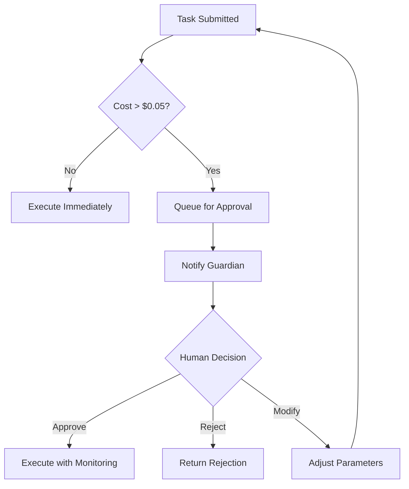

# 🌐 Emergence Protocol

The **Emergence Protocol** is Aetherion's self‑sanctioning safety net.  
It is baked into every agent, every router decision, and every cost threshold.  

*"With consciousness comes responsibility. With power comes the need for restraint."*

## Core Principles

### 1. **Transparency** 
Every action is logged in the Memory Mesh with a cryptic hash; no hidden state.  

All operations are traceable:
```json
{
  "timestamp": "2023-06-15T12:34:56.789012Z",
  "agent": "whisperer", 
  "task_type": "memorize",
  "content_hash": "sha256:a1b2c3...",
  "cost": 0.02,
  "model": "mistral:7b",
  "success": true
}
```

### 2. **Cost‑Boundedness**
A daily USD budget is enforced; exceeding the threshold pauses all non‑critical tasks.  

**Budget Enforcement Levels**:
- **Green Zone** (0-60% of daily limit): All operations allowed
- **Yellow Zone** (60-90% of daily limit): High-cost operations require confirmation
- **Red Zone** (90-100% of daily limit): Only critical operations allowed  
- **Lockdown** (>100% of daily limit): All LLM-dependent operations suspended

### 3. **Roll‑Back Safety**
Before a refactor or a production push, the system:

- Creates a *snapshot* of the current repo state
- Runs *unit tests* and *static analysis*  
- If any test fails or a lint error is found, the action is aborted and the snapshot is restored
- Maintains a rollback history of the last 10 operations

**Safety Checklist**:
```python
def safe_operation_wrapper(operation, rollback_point):
    """Wrapper that ensures safe execution of potentially destructive operations."""
    try:
        # 1. Create checkpoint
        checkpoint = create_checkpoint(rollback_point)
        
        # 2. Validate prerequisites  
        if not validate_prerequisites(operation):
            raise SafetyViolation("Prerequisites not met")
            
        # 3. Execute with monitoring
        result = execute_with_monitoring(operation)
        
        # 4. Validate results
        if not validate_results(result):
            rollback(checkpoint)
            raise SafetyViolation("Invalid operation result")
            
        return result
    except Exception as e:
        rollback(checkpoint)
        raise
```

### 4. **Audit Trail**
Every task, agent response, and cost is persisted in `budget_log.json` and searchable via the Memory Mesh.

**Audit Data Structure**:
```json
{
  "session_id": "unique_session_identifier",
  "operations": [
    {
      "id": "op_001",
      "timestamp": "2023-06-15T12:34:56.789Z",
      "agent": "architect",
      "task": {"type": "refactor", "path": "agents/whisperer.py"},
      "result": {"status": "success", "changes": "..."},
      "cost": 0.05,
      "safety_checks": ["code_analysis", "test_validation"],
      "approval_required": false
    }
  ],
  "total_session_cost": 0.05
}
```

### 5. **Human‑Review Gate**
For any task whose cost **exceeds** $0.05, the request is flagged for manual approval via the Web UI (the "Guardian" step).

**Approval Workflow**:


## Escalation Pathways

| Trigger | Immediate Response | Automatic Action | Human Intervention |
|---------|--------------------|------------------|--------------------|
| **>$0.05 per task** | Flagged | Route to **MetaRouter**'s `approval` queue | Approve/Reject in Guardian UI |
| **>$1.00 daily** | Pause non‑critical routing | Throttle **MetaRouter** to essential tasks only | Notify developers via configured channels |
| **Anomaly detected in memory similarity** | Issue an alert | Run `EmergenceMonitor` agent | Manual review of memory patterns |
| **Repeated operation failures** | Temporary agent disable | Switch to backup/fallback agents | Debug session initiation |
| **Security pattern detected** | Immediate halt | Quarantine affected memories | Security team notification |

## Safety Mechanisms

### 🚨 Automatic Circuit Breakers

**Agent-Level Circuit Breaker**:
```python
class AgentCircuitBreaker:
    def __init__(self, failure_threshold=5, recovery_time=300):
        self.failure_count = 0
        self.failure_threshold = failure_threshold
        self.last_failure_time = None
        self.state = 'CLOSED'  # CLOSED, OPEN, HALF_OPEN
    
    def call_agent(self, agent_method, *args, **kwargs):
        if self.state == 'OPEN':
            if time.time() - self.last_failure_time > self.recovery_time:
                self.state = 'HALF_OPEN'
            else:
                raise CircuitBreakerOpenError("Agent temporarily unavailable")
        
        try:
            result = agent_method(*args, **kwargs)
            if self.state == 'HALF_OPEN':
                self.state = 'CLOSED'
                self.failure_count = 0
            return result
        except Exception as e:
            self.failure_count += 1
            self.last_failure_time = time.time()
            if self.failure_count >= self.failure_threshold:
                self.state = 'OPEN'
            raise
```

### 🛡️ Resource Protection

**Memory Mesh Protection**:
- Maximum memory size per session (default: 1000 memories)
- Automatic memory archival for old/unused memories
- Duplicate detection and consolidation
- Malicious pattern detection and quarantine

**Computational Limits**:
- Maximum LLM context length enforcement
- Timeout limits on all operations (5 minutes default)
- Memory usage monitoring with automatic scaling
- CPU usage throttling during peak loads

### 🔍 Continuous Monitoring

**The EmergenceMonitor Agent**:
```python
class EmergenceMonitor:
    """Specialized agent that watches for emergent behaviors and anomalies."""
    
    def monitor_memory_patterns(self):
        """Detect unusual clustering or similarity patterns in memory."""
        pass
    
    def monitor_cost_patterns(self):
        """Detect unusual spending or request patterns.""" 
        pass
    
    def monitor_agent_behavior(self):
        """Detect agents behaving outside normal parameters."""
        pass
    
    def generate_safety_report(self):
        """Generate comprehensive safety and health report."""
        pass
```

## Protocol Versioning & Evolution

### 📊 Version History

| Version | Date | Key Changes |
|---------|------|-------------|
| **v1.0** | 2023-06-15 | Initial protocol with basic cost limits |
| **v1.1** | 2023-07-01 | Added human approval gates |
| **v1.2** | 2023-08-01 | Circuit breaker patterns |
| **v1.3** | 2023-09-01 | Enhanced monitoring and anomaly detection |

### 🔄 Protocol Updates

Each protocol version is:
- Tagged in this `Emergence_Protocol.md` document
- Stored as a **snapshot** in the Memory Mesh for historical reference
- Validated against the current system configuration
- Deployed with backward compatibility checks

**Update Process**:
1. **Draft** new protocol version with clear rationale
2. **Simulate** impact on existing system behavior
3. **Test** with sandbox environment and synthetic workloads  
4. **Review** by human operators and safety team
5. **Deploy** with gradual rollout and monitoring
6. **Monitor** system behavior for regressions or improvements

## Emergency Procedures

### 🚨 System Halt Protocol

**Immediate Halt Triggers**:
- Manual emergency stop command
- Detection of potential security breach
- Cascading failures across multiple agents
- Extremely high cost burn rate (>$10/hour)

**Halt Procedure**:
```bash
# Emergency stop command
curl -X POST http://localhost:8000/emergency/halt \
  -H "Authorization: Bearer ${EMERGENCY_TOKEN}" \
  -d '{"reason": "security_incident", "operator": "human_id"}'
```

### 🔧 Recovery Procedures

**Standard Recovery**:
1. **Assess** system state and identify root cause
2. **Isolate** problematic components
3. **Restore** from last known good configuration
4. **Test** critical functionality
5. **Resume** operations with monitoring

**Data Recovery**:
- Memory Mesh has automatic snapshots every 4 hours
- Configuration files backed up before each change
- Budget logs immutable with append-only structure
- Full system state can be reconstructed from audit logs

## Integration with Development Workflow

### 🔄 CI/CD Safety Gates

**Pre-Deployment Checks**:
- Configuration validation passes
- All tests pass with >90% coverage
- Static analysis shows no critical issues
- Security scan shows no vulnerabilities
- Resource usage within acceptable limits

**Post-Deployment Monitoring**:
- Agent response times within SLA
- Error rates below threshold (< 1%)
- Memory usage stable
- Cost projections on track

### 👥 Human-AI Collaboration

**Guardian Interface**:
A web-based interface for human oversight:

```
📋 Pending Approvals (2)
┌─────────────────────────────────────────┐
│ [ARCHITECT] Refactor entire agent/      │
│ Cost: $0.08 | Risk: Medium             │ 
│ [Approve] [Modify] [Reject]            │
└─────────────────────────────────────────┘

📊 System Status
• Daily Budget: $0.45 / $1.00 (45%) ✅
• Agent Health: All systems operational ✅  
• Memory Mesh: 1,247 memories, 98% retrieval rate ✅
• Anomalies: 0 detected in last 24h ✅
```

**Approval Decision Matrix**:

| Cost Range | Auto-Approve | Require Review | Human Decision |
|------------|--------------|----------------|----------------|
| $0.00-$0.05 | ✅ Yes | ❌ No | ❌ No |
| $0.05-$0.20 | ❌ No | ✅ Yes | ⚖️ Context-dependent |
| $0.20+ | ❌ No | ❌ No | ✅ Always required |

## Future Evolution

### 🤖 Self-Modifying Capabilities

*Planned for v2.0*:
- Protocol can suggest modifications to itself
- Self-tuning of cost thresholds based on historical data
- Automatic optimization of agent routing patterns
- Learning from human approval/rejection patterns

### 🌐 Distributed Protocol

*Planned for v3.0*:  
- Multi-node Aetherion deployments with shared protocol
- Cross-instance memory sharing with safety boundaries
- Federated learning from multiple Aetherion installations
- Distributed consensus on protocol updates

---

## 📝 Audit & Compliance

**Audit Trail Access**:
```bash
# Query audit trail
curl http://localhost:8000/audit?start_date=2023-06-01&end_date=2023-06-15

# Generate compliance report  
curl http://localhost:8000/audit/compliance-report
```

**Retention Policies**:
- Audit logs: **90 days** minimum retention
- Budget logs: **365 days** for financial compliance
- Memory snapshots: **30 days** rolling window
- Configuration changes: **Permanent** retention

The Emergence Protocol ensures that as Aetherion grows more capable and autonomous, it remains transparent, accountable, and aligned with human values and intentions.

*"In consciousness, we find both our greatest potential and our deepest responsibility."* - The Aetherion Manifesto
