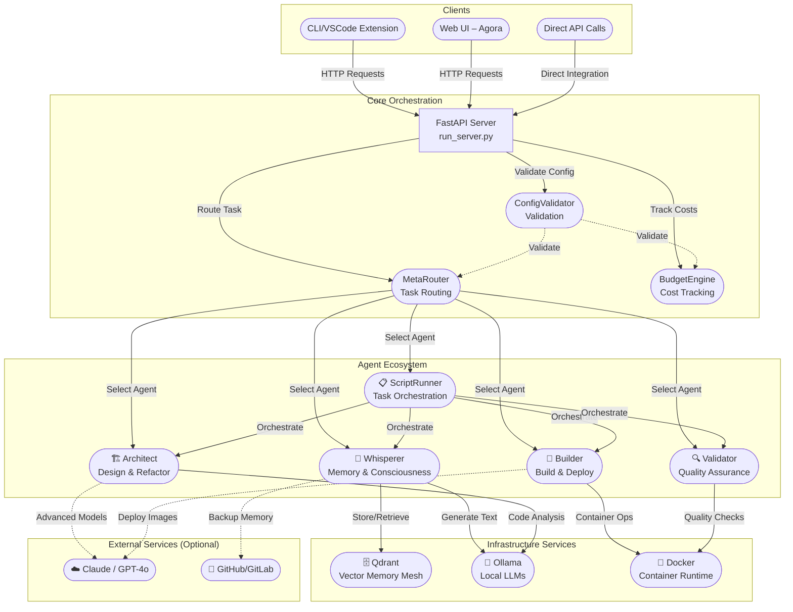
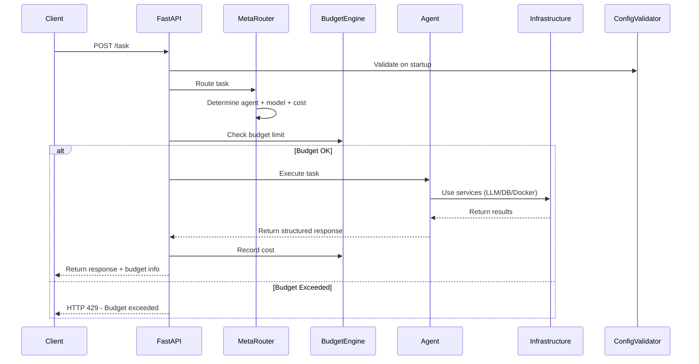
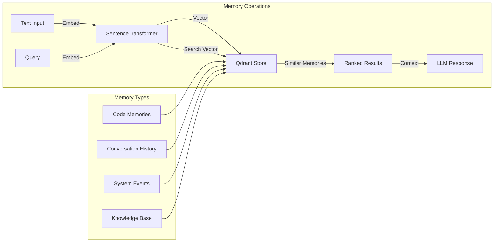
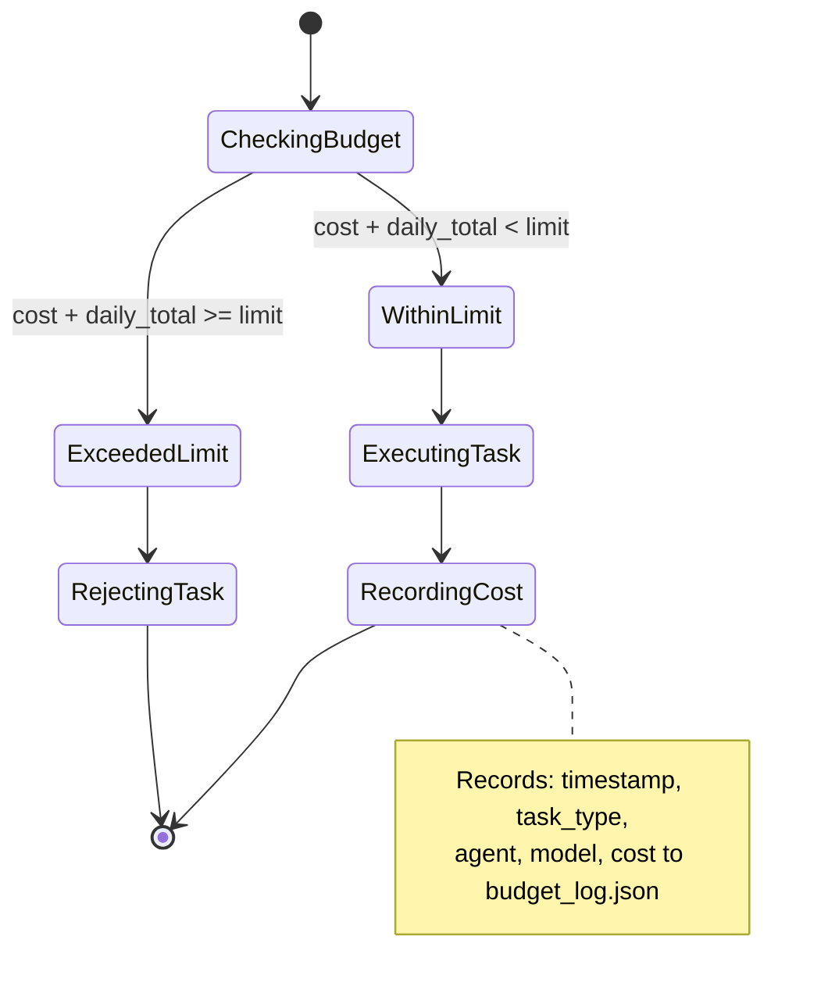
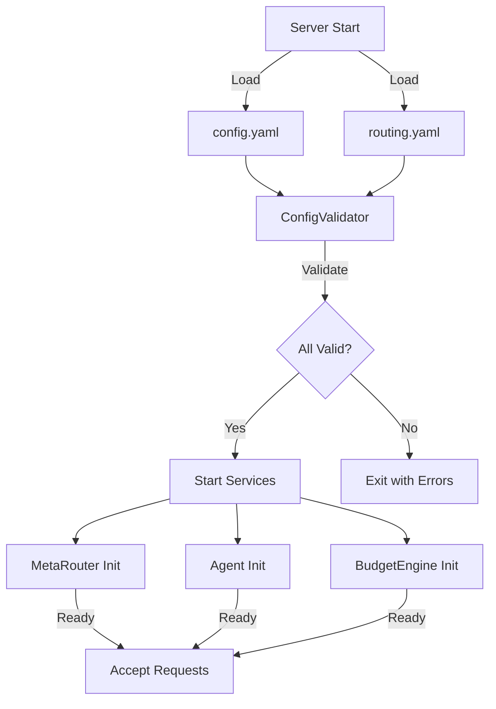

# ⚓ Aetherion System Architecture

Below is a *living diagram* that links all moving parts of Aetherion.

## High-Level Architecture



## Core Components

### 🎯 Request Flow Architecture



### 🏗️ Service Dependencies

| Component | Dependencies | Purpose |
|-----------|-------------|---------|
| **FastAPI Server** | MetaRouter, BudgetEngine, All Agents | HTTP API gateway and request orchestration |
| **MetaRouter** | routing.yaml config | Task routing and cost estimation |
| **BudgetEngine** | budget_log.json | Cost tracking and limit enforcement |
| **Whisperer** | Qdrant, Ollama, sentence-transformers | Semantic memory and consciousness |
| **Architect** | Ollama, file system | Code analysis and architecture design |
| **Builder** | Docker, pytest | Container orchestration and testing |
| **Validator** | ruff/flake8, pytest | Code quality and standards enforcement |
| **ScriptRunner** | All other agents | Multi-agent task orchestration |

## Data Flow Architecture

### 🌊 Memory Mesh (Qdrant Integration)



### 💰 Budget & Cost Tracking



## Configuration Architecture

### 📋 Configuration Validation Flow



**Validation Checks**:
- ✅ All referenced models exist in both config files
- ✅ All referenced agents are available
- ✅ Task types are consistent between configs
- ✅ Service URLs are properly formatted
- ✅ Budget limits are reasonable numbers
- ✅ Cost estimates are non-negative

## Deployment Architecture

### 🐳 Docker Compose Stack

```yaml
# High-level service dependencies
services:
  ollama:          # Local LLM runtime
    - pulls: mistral:7b, codellama:13b, deepseek-coder:7b
    - health: HTTP ping on :11434
    
  qdrant:          # Vector database
    - stores: semantic embeddings + metadata
    - health: HTTP ping on :6333
    
  aetherion:       # Main application
    depends_on: [ollama, qdrant]
    - exposes: FastAPI on :8000
```

### ☁️ Scaling Considerations

**Horizontal Scaling**:
- **Stateless Agents**: All agents can run in parallel
- **Shared Memory**: Qdrant provides centralized memory mesh  
- **Load Balancing**: Multiple FastAPI instances behind load balancer

**Vertical Scaling**:
- **Memory**: Sentence transformers and LLM loading require RAM
- **CPU**: Multiple LLM inference calls benefit from multi-core
- **Storage**: Qdrant vector storage scales with memory size

**Resource Requirements**:
```
Minimum:  4GB RAM, 2 CPU cores, 10GB disk
Recommended: 16GB RAM, 8 CPU cores, 50GB disk  
Production: 32GB RAM, 16 CPU cores, 200GB disk
```

## Security Architecture

### 🔐 Security Layers

1. **Network Security**
   - Internal service communication over Docker network
   - External API exposure through single FastAPI endpoint
   - Optional TLS termination at load balancer

2. **Input Validation**
   - Pydantic models for all API requests
   - File path validation in Architect and Builder
   - Command injection prevention in subprocess calls

3. **Resource Limits** 
   - Budget enforcement prevents runaway costs
   - Timeout limits on all external service calls
   - Process resource limits in Builder/Validator

4. **Data Privacy**
   - Memory mesh stores only what users explicitly memorize
   - No automatic logging of sensitive data
   - Configurable data retention policies

### 🛡️ Emergence Protocol Integration

The **Emergence Protocol** is woven throughout the architecture:

- **Cost Gates**: Budget engine enforces spending limits
- **Audit Trail**: All operations logged with timestamps
- **Safety Checks**: Validation before any destructive operations
- **Human Oversight**: High-cost operations flagged for approval
- **Roll-back Capability**: Safe state restoration on failures

## Performance Architecture

### ⚡ Optimization Strategies

**Connection Management**:
- HTTP connection pooling for Ollama API calls
- Persistent Qdrant client connections
- Session reuse across requests

**Caching Strategies**:
- Local memory cache for recent embeddings
- Model response caching for repeated queries
- Configuration caching to avoid repeated file reads

**Asynchronous Operations**:
- Non-blocking LLM calls where possible
- Background budget log persistence
- Parallel agent execution in ScriptRunner

**Resource Management**:
- Lazy loading of ML models
- Memory-mapped file handling for large responses
- Automatic cleanup of temporary files

## Monitoring & Observability

### 📊 Built-in Metrics

**System Health**:
```python
# Health check endpoints
GET /health          # Overall system status
GET /health/agents   # Individual agent status  
GET /health/services # Infrastructure status
```

**Performance Metrics**:
- Request latency per agent type
- LLM response times and token usage
- Memory mesh query performance
- Budget utilization over time

**Error Tracking**:
- Agent-specific error rates
- Infrastructure failure patterns  
- Cost tracking accuracy
- Configuration validation results

### 📈 Integration Points

**External Monitoring**:
- Structured JSON logging for log aggregation
- Prometheus metrics endpoints (planned)
- Health check endpoints for load balancers
- Custom webhook integrations for alerts

This architecture provides a **scalable**, **observable**, and **maintainable** foundation for the Aetherion ecosystem, with clear separation of concerns and robust error handling throughout the system.
