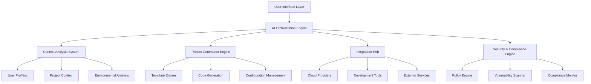

# The Universal AI Development Platform: Vision & Implementation

## 🚀 The Vision: "DevGenie" - Your AI Development Companion

Imagine a platform that understands your intent before you finish typing, adapts to your workflow like a seasoned colleague, and removes every friction point between idea and deployment. This isn't just another IDE plugin - it's a revolutionary development ecosystem.

### The Core Promise
**"From idea to production in minutes, not months. From complexity to clarity. From isolation to integration."**

## 🎯 Pain Points We Solve

### For Different User Personas:

#### **Newcomers & Students**
- **Pain**: Overwhelming complexity, unclear starting points, scattered tutorials
- **Solution**: Guided project creation with contextual learning, progressive complexity revelation, mentor AI that explains every step

#### **Junior Developers**
- **Pain**: Best practice uncertainty, architecture decisions, debugging complex issues
- **Solution**: AI-powered code reviews, architecture suggestions, pattern recognition and recommendation

#### **Senior Developers**
- **Pain**: Repetitive setup tasks, integration complexity, staying current with evolving ecosystem
- **Solution**: Intelligent automation, seamless integrations, trend awareness and migration assistance

#### **DevOps Teams**
- **Pain**: Environment drift, configuration management, security compliance
- **Solution**: Infrastructure as Code generation, compliance checking, automated security hardening

#### **Enterprises**
- **Pain**: Standardization, governance, security, audit trails
- **Solution**: Organization-wide templates, policy enforcement, comprehensive audit logging

#### **Startups & Agencies**
- **Pain**: Speed to market, resource constraints, client customization
- **Solution**: Rapid prototyping, resource optimization, client-specific adaptations

## 🏗️ System Architecture: The Complete Platform

### Core Components



### The AI Orchestration Engine
**The Brain of the Platform**

```python
class AIOrchestrator:
    def __init__(self):
        self.context_analyzer = ContextAnalyzer()
        self.project_generator = ProjectGenerator()
        self.integration_manager = IntegrationManager()
        self.security_enforcer = SecurityEnforcer()
        self.learning_system = ContinuousLearningSystem()
    
    async def create_project(self, user_intent: str, context: Dict):
        # Analyze user intent and context
        analysis = await self.context_analyzer.analyze(user_intent, context)
        
        # Generate project structure and code
        project = await self.project_generator.generate(analysis)
        
        # Setup integrations and dependencies
        integrations = await self.integration_manager.setup(project, analysis)
        
        # Apply security and compliance policies
        secured_project = await self.security_enforcer.harden(project, analysis)
        
        # Learn from this interaction
        await self.learning_system.update(user_intent, context, secured_project)
        
        return secured_project
```

## 🧠 Intelligent Features

### 1. Context-Aware Project Generation

**Natural Language Project Creation:**
```
User: "Create a scalable e-commerce API with microservices architecture, 
       PostgreSQL database, Redis caching, JWT authentication, 
       deployed on AWS with monitoring and CI/CD"

Platform: ✨ Analyzing requirements...
         🏗️ Generating microservices architecture...
         🔒 Implementing security best practices...
         ☁️ Configuring AWS infrastructure...
         📊 Setting up monitoring stack...
         🚀 Creating CI/CD pipeline...
         ✅ Project ready in 47 seconds!
```

### 2. Adaptive Intelligence System

```python
class AdaptiveIntelligence:
    def __init__(self):
        self.user_patterns = UserPatternAnalyzer()
        self.code_style_learner = CodeStyleLearner()
        self.workflow_optimizer = WorkflowOptimizer()
    
    def adapt_to_user(self, user_id: str, project_history: List[Project]):
        # Learn user preferences
        preferences = self.user_patterns.analyze(project_history)
        
        # Adapt code generation style
        style_guide = self.code_style_learner.create_guide(user_id)
        
        # Optimize workflow based on patterns
        workflow = self.workflow_optimizer.optimize(preferences)
        
        return UserAdaptation(preferences, style_guide, workflow)
```

### 3. Multi-Modal Integration Hub

```yaml
integrations:
  cloud_providers:
    - aws: {auto_configure: true, cost_optimize: true}
    - gcp: {ml_optimized: true}
    - azure: {enterprise_ready: true}
  
  ai_services:
    - openai: {models: [gpt-4, embedding]}
    - anthropic: {models: [claude-3]}
    - hugging_face: {private_models: true}
  
  development_tools:
    - github: {actions: true, security: advanced}
    - vscode: {extensions: auto_install}
    - docker: {multi_arch: true}
  
  databases:
    - postgresql: {optimized_config: true}
    - mongodb: {sharding_ready: true}
    - redis: {cluster_mode: true}
  
  monitoring:
    - datadog: {apm: true, logs: true}
    - prometheus: {custom_metrics: true}
    - sentry: {performance_monitoring: true}
```

## 🔧 Implementation Roadmap

### Phase 1: Core Platform (Months 1-3)

#### 1.1 Foundation Architecture
```typescript
// Platform Core
interface PlatformCore {
  userManager: UserManager;
  projectEngine: ProjectEngine;
  templateSystem: TemplateSystem;
  integrationHub: IntegrationHub;
}

class DevGeniePlatform implements PlatformCore {
  constructor() {
    this.aiOrchestrator = new AIOrchestrator();
    this.contextSystem = new ContextSystem();
    this.securityEngine = new SecurityEngine();
  }
}
```

#### 1.2 User Interface (React + Electron)
```tsx
// Main Platform Interface
const DevGenieIDE: React.FC = () => {
  const [projectIntent, setProjectIntent] = useState('');
  const [generatedProject, setGeneratedProject] = useState(null);
  
  const handleProjectCreation = async () => {
    const project = await devGenieAPI.createProject({
      intent: projectIntent,
      context: await gatherContext(),
      userPreferences: getUserPreferences()
    });
    setGeneratedProject(project);
  };

  return (
    <PlatformLayout>
      <IntentCapture onIntentChange={setProjectIntent} />
      <ContextAnalysis />
      <ProjectPreview project={generatedProject} />
      <IntegrationPanel />
      <DeploymentManager />
    </PlatformLayout>
  );
};
```

### Phase 2: AI Intelligence (Months 4-6)

#### 2.1 Context Analysis System
```python
class ContextAnalyzer:
    def __init__(self):
        self.nlp_processor = NLPProcessor()
        self.pattern_recognizer = PatternRecognizer()
        self.requirement_extractor = RequirementExtractor()
    
    async def analyze(self, user_input: str, environment: Dict) -> ProjectContext:
        # Extract technical requirements
        tech_requirements = self.requirement_extractor.extract(user_input)
        
        # Analyze user patterns
        user_patterns = await self.pattern_recognizer.analyze_user_history()
        
        # Consider environment constraints
        env_constraints = self.analyze_environment(environment)
        
        return ProjectContext(
            requirements=tech_requirements,
            patterns=user_patterns,
            constraints=env_constraints,
            recommendations=self.generate_recommendations()
        )
```

#### 2.2 Intelligent Code Generation
```python
class IntelligentCodeGenerator:
    def __init__(self):
        self.llm_ensemble = LLMEnsemble([
            OpenAIModel("gpt-4"),
            AnthropicModel("claude-3"),
            LocalModel("codellama")
        ])
        self.code_validator = CodeValidator()
        self.security_checker = SecurityChecker()
    
    async def generate_project(self, context: ProjectContext) -> Project:
        # Generate architecture
        architecture = await self.generate_architecture(context)
        
        # Generate code for each component
        components = []
        for component in architecture.components:
            code = await self.generate_component_code(component, context)
            validated_code = self.code_validator.validate(code)
            secure_code = self.security_checker.harden(validated_code)
            components.append(secure_code)
        
        return Project(architecture=architecture, components=components)
```

### Phase 3: Integration Ecosystem (Months 7-9)

#### 3.1 Universal Integration System
```python
class IntegrationHub:
    def __init__(self):
        self.providers = {
            'cloud': CloudProviderManager(),
            'database': DatabaseManager(),
            'monitoring': MonitoringManager(),
            'ci_cd': CICDManager(),
            'security': SecurityManager()
        }
    
    async def setup_integrations(self, project: Project, requirements: List[str]):
        integration_plan = self.create_integration_plan(requirements)
        
        for integration in integration_plan:
            provider = self.providers[integration.category]
            config = await provider.generate_config(integration, project)
            await provider.deploy(config)
            
        return IntegrationResult(
            configurations=integration_plan,
            deployment_status="success",
            endpoints=self.extract_endpoints()
        )
```

#### 3.2 Cloud Resource Management
```python
class CloudResourceManager:
    def __init__(self):
        self.aws_manager = AWSManager()
        self.gcp_manager = GCPManager()
        self.azure_manager = AzureManager()
    
    async def provision_infrastructure(self, project: Project) -> Infrastructure:
        # Analyze resource requirements
        requirements = self.analyze_requirements(project)
        
        # Select optimal cloud provider
        provider = self.select_provider(requirements)
        
        # Generate infrastructure as code
        iac = await provider.generate_iac(requirements)
        
        # Deploy with monitoring
        deployment = await provider.deploy(iac)
        
        return Infrastructure(
            provider=provider.name,
            resources=deployment.resources,
            monitoring=deployment.monitoring,
            costs=deployment.cost_estimation
        )
```

### Phase 4: Advanced Intelligence (Months 10-12)

#### 4.1 Continuous Learning System
```python
class ContinuousLearningSystem:
    def __init__(self):
        self.user_feedback_analyzer = FeedbackAnalyzer()
        self.performance_monitor = PerformanceMonitor()
        self.trend_analyzer = TrendAnalyzer()
        self.model_updater = ModelUpdater()
    
    async def learn_and_improve(self):
        # Analyze user feedback
        feedback_insights = self.user_feedback_analyzer.analyze()
        
        # Monitor platform performance
        performance_data = self.performance_monitor.collect()
        
        # Analyze industry trends
        trends = self.trend_analyzer.analyze_trends()
        
        # Update AI models
        await self.model_updater.update_models(
            feedback_insights, 
            performance_data, 
            trends
        )
```

#### 4.2 Security & Compliance Engine
```python
class SecurityComplianceEngine:
    def __init__(self):
        self.vulnerability_scanner = VulnerabilityScanner()
        self.compliance_checker = ComplianceChecker()
        self.policy_enforcer = PolicyEnforcer()
        self.audit_logger = AuditLogger()
    
    async def secure_project(self, project: Project, policies: List[Policy]) -> SecureProject:
        # Scan for vulnerabilities
        vulnerabilities = await self.vulnerability_scanner.scan(project)
        
        # Check compliance requirements
        compliance_status = self.compliance_checker.check(project, policies)
        
        # Enforce security policies
        secured_project = self.policy_enforcer.enforce(project, policies)
        
        # Log security actions
        self.audit_logger.log_security_actions(secured_project)
        
        return SecureProject(
            project=secured_project,
            security_report=vulnerabilities,
            compliance_status=compliance_status
        )
```

## 🔌 Platform Extensions & Ecosystem

### IDE Extensions
```json
{
  "vscode": {
    "extension_id": "devgenie.ai-platform",
    "features": [
      "natural_language_coding",
      "context_aware_suggestions", 
      "automated_refactoring",
      "security_scanning",
      "performance_optimization"
    ]
  },
  "jetbrains": {
    "plugin_id": "devgenie-intellij",
    "compatibility": ["IntelliJ", "PyCharm", "WebStorm"]
  }
}
```

### Web Platform
```typescript
// Progressive Web App
class DevGenieWebPlatform {
  constructor() {
    this.workspaceManager = new WorkspaceManager();
    this.collaborationEngine = new CollaborationEngine();
    this.cloudSync = new CloudSyncManager();
  }

  async createProject(intent: string): Promise<Project> {
    const context = await this.gatherWebContext();
    return await this.aiOrchestrator.createProject(intent, context);
  }
}
```

## 🌐 Deployment Strategy

### Multi-Platform Architecture
```yaml
deployment:
  desktop_app:
    platform: electron
    features: [offline_mode, local_llm_support]
    
  web_platform:
    platform: next_js
    features: [real_time_collaboration, cloud_integration]
    
  ide_extensions:
    vscode: marketplace_ready
    jetbrains: plugin_marketplace
    
  api_platform:
    architecture: microservices
    deployment: kubernetes
    scaling: auto_scaling
```

### Infrastructure
```terraform
# Core Platform Infrastructure
resource "kubernetes_cluster" "devgenie_platform" {
  name     = "devgenie-platform"
  location = "us-central1-a"

  node_pool {
    name       = "ai-processing"
    node_count = 3
    
    node_config {
      machine_type = "n1-highcpu-16"
      disk_size_gb = 100
      
      labels = {
        workload = "ai-inference"
      }
    }
  }
}

# AI Model Serving
resource "kubernetes_deployment" "ai_models" {
  metadata {
    name = "ai-model-server"
  }
  
  spec {
    replicas = 3
    
    template {
      spec {
        container {
          name  = "model-server"
          image = "devgenie/ai-models:latest"
          
          resources {
            requests = {
              cpu    = "4"
              memory = "8Gi"
            }
            limits = {
              cpu    = "8"
              memory = "16Gi"
            }
          }
        }
      }
    }
  }
}
```

## 🚀 Monetization Strategy

### Tiered Service Model
```yaml
pricing_tiers:
  free:
    projects_per_month: 5
    ai_generations: 50
    integrations: basic
    support: community
    
  professional:
    price: "$29/month"
    projects_per_month: unlimited
    ai_generations: 1000
    integrations: advanced
    support: email
    features: [team_collaboration, custom_templates]
    
  enterprise:
    price: "custom"
    features: [
      on_premise_deployment,
      custom_integrations,
      dedicated_support,
      compliance_reporting,
      audit_logging
    ]
```

## 📈 Success Metrics & KPIs

### User Experience Metrics
```python
class PlatformMetrics:
    def __init__(self):
        self.metrics = {
            'time_to_first_project': TimeMeasurement(),
            'project_success_rate': SuccessRate(),
            'user_satisfaction': SatisfactionScore(),
            'feature_adoption': AdoptionTracking(),
            'support_ticket_volume': SupportMetrics()
        }
    
    def track_user_journey(self, user_id: str, event: str):
        self.metrics[event].record(user_id, timestamp=now())
```

## 🎯 The Ultimate Vision Realized

This platform becomes the **"GitHub Copilot for entire projects"** - but exponentially more powerful:

1. **Natural Language to Full Stack**: Speak your idea, get a production-ready application
2. **Adaptive Intelligence**: Learns your style, anticipates your needs
3. **Zero-Config Deployment**: From development to production seamlessly
4. **Universal Integration**: Works with any tool, service, or platform
5. **Continuous Evolution**: Gets smarter with every interaction
6. **Enterprise Ready**: Secure, compliant, auditable from day one

### The Developer Experience Revolution

```
Developer: "Create a social media platform like Twitter but with end-to-end 
          encryption, blockchain verification, and AI content moderation"

DevGenie: ✨ Analyzing requirements...
         🏗️ Designing distributed architecture...
         🔐 Implementing E2E encryption layer...
         ⛓️ Setting up blockchain integration...
         🤖 Configuring AI moderation pipeline...
         ☁️ Provisioning scalable infrastructure...
         🔒 Applying security hardening...
         📊 Setting up comprehensive monitoring...
         🚀 Deploying to production environment...
         
         ✅ Platform deployed successfully!
         📱 iOS/Android apps ready for testing
         🌐 Web app live at: https://your-platform.com
         📊 Dashboard: https://admin.your-platform.com
         📚 API docs: https://api-docs.your-platform.com
         
         Total time: 3 minutes 42 seconds
         Estimated manual development time saved: 6-12 months
```

This is not just a tool - it's a paradigm shift that democratizes complex software development, making it accessible to anyone with an idea, while empowering experts to focus on innovation rather than configuration.

The future of development is here. Welcome to DevGenie. 🚀✨
