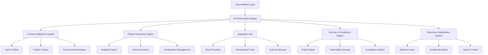

# DevGenie: Comprehensive Technical Implementation Plan
*From Vision to Production-Ready AI Development Platform*

## 🎯 Executive Summary

DevGenie represents a paradigm shift in software development - an AI-powered platform that transforms natural language intent into production-ready, secure, scalable applications in minutes rather than months. This implementation plan outlines the technical architecture, development roadmap, and strategic approach to build what could become the "AWS of development platforms."

## 🏗️ System Architecture Overview

### Core Platform Components



## 🧠 Phase 1: AI Model Training Strategy (Months 1-6)

### Model Ensemble Architecture

**Core Principle**: No single AI model excels at all tasks. DevGenie uses specialized models optimized for specific functions.

#### Model Specialization Matrix

| Model Type | Primary Function | Training Focus | Performance Target |
|------------|------------------|----------------|-------------------|
| **Intent Analyzer** | Requirements extraction | NLP + Domain knowledge | >95% intent classification accuracy |
| **Architecture Designer** | System architecture | Patterns + Constraints | >90% build success rate |
| **Code Synthesizer** | Code generation | Multi-language + Quality | >98% compilation success |
| **Security Auditor** | Vulnerability detection | Security patterns | Zero critical vulnerabilities |
| **Integration Planner** | Service orchestration | API compatibility | >99% integration success |

### Training Data Pipeline

```python
class TrainingDataPipeline:
    """Comprehensive data pipeline for model training"""
    
    def __init__(self):
        self.gold_pairs_collector = GoldPairsCollector()
        self.synthetic_generator = SyntheticDataGenerator()
        self.feedback_processor = FeedbackProcessor()
        self.quality_validator = DataQualityValidator()
    
    async def generate_training_data(self) -> TrainingDataset:
        # Collect high-quality human-authored examples
        gold_pairs = await self.gold_pairs_collector.collect_examples([
            "github_repos_with_detailed_specs",
            "internal_project_templates",
            "customer_success_stories"
        ])
        
        # Generate synthetic variations
        synthetic_data = await self.synthetic_generator.generate_variations(
            gold_pairs,
            variations=["different_scales", "security_requirements", "compliance_needs"]
        )
        
        # Process user feedback for continuous improvement
        feedback_data = await self.feedback_processor.process_feedback()
        
        # Validate and clean dataset
        validated_dataset = await self.quality_validator.validate_and_clean(
            gold_pairs + synthetic_data + feedback_data
        )
        
        return validated_dataset
```

### Model Training Architecture

```python
class ModelTrainingOrchestrator:
    """Orchestrates training across specialized model ensemble"""
    
    def __init__(self):
        self.model_configs = {
            'intent_analyzer': {
                'base_model': 'gpt-4o',
                'fine_tune_layers': ['attention', 'output'],
                'training_strategy': 'supervised_fine_tuning'
            },
            'architecture_designer': {
                'base_model': 'claude-3.5-sonnet',
                'fine_tune_layers': ['reasoning', 'planning'],
                'training_strategy': 'reinforcement_learning_from_feedback'
            },
            'code_synthesizer': {
                'base_model': 'codellama-70b',
                'fine_tune_layers': ['code_generation', 'optimization'],
                'training_strategy': 'preference_optimization'
            }
        }
    
    async def train_model_ensemble(self, training_data: TrainingDataset):
        trained_models = {}
        
        for model_name, config in self.model_configs.items():
            # Prepare model-specific training data
            model_data = training_data.filter_for_model(model_name)
            
            # Initialize model with base weights
            model = await self.initialize_model(config['base_model'])
            
            # Apply fine-tuning strategy
            trained_model = await self.fine_tune_model(
                model, 
                model_data, 
                config['training_strategy']
            )
            
            # Validate model performance
            validation_results = await self.validate_model(trained_model, model_name)
            
            if validation_results.passes_quality_gates():
                trained_models[model_name] = trained_model
            else:
                # Retrain with adjusted parameters
                trained_models[model_name] = await self.retrain_with_adjustments(
                    trained_model, validation_results
                )
        
        return trained_models
```

### Continuous Learning System

```python
class ContinuousLearningSystem:
    """Implements continuous improvement based on real-world usage"""
    
    def __init__(self):
        self.feedback_collector = FeedbackCollector()
        self.pattern_extractor = PatternExtractor()
        self.model_updater = IncrementalModelUpdater()
        self.a_b_tester = ModelABTester()
    
    async def continuous_improvement_cycle(self):
        # Collect performance feedback
        feedback = await self.feedback_collector.collect_recent_feedback()
        
        # Extract successful patterns
        success_patterns = await self.pattern_extractor.extract_patterns(
            feedback.successful_projects
        )
        
        # Identify failure modes
        failure_patterns = await self.pattern_extractor.extract_patterns(
            feedback.failed_projects
        )
        
        # Update models incrementally
        updated_models = await self.model_updater.update_models(
            success_patterns, failure_patterns
        )
        
        # A/B test model improvements
        ab_results = await self.a_b_tester.test_model_performance(
            current_models=self.production_models,
            candidate_models=updated_models,
            traffic_split=0.1
        )
        
        # Promote better performing models
        if ab_results.candidate_outperforms_current():
            await self.promote_models_to_production(updated_models)
```

## 🔧 Phase 2: Integration Framework Architecture (Months 4-9)

### Universal Integration System

The integration framework is the nervous system of DevGenie - connecting generated projects to the vast ecosystem of cloud services, databases, and development tools.

```python
class UniversalIntegrationFramework:
    """Manages all third-party integrations with intelligent orchestration"""
    
    def __init__(self):
        self.provider_registry = ProviderRegistry()
        self.capability_matcher = CapabilityMatcher()
        self.config_generator = IntelligentConfigGenerator()
        self.provisioning_engine = ProvisioningEngine()
        self.verification_system = VerificationSystem()
    
    async def orchestrate_project_integrations(
        self, 
        project_spec: ProjectSpecification,
        user_preferences: UserPreferences
    ) -> IntegrationResult:
        
        # Analyze required capabilities
        required_capabilities = await self.analyze_integration_requirements(project_spec)
        
        # Match capabilities to optimal providers
        provider_matches = await self.capability_matcher.find_optimal_providers(
            required_capabilities, 
            user_preferences.constraints
        )
        
        # Generate intelligent configurations
        configurations = await self.config_generator.generate_all_configurations(
            provider_matches, 
            project_spec
        )
        
        # Create provisioning plan
        provisioning_plan = await self.provisioning_engine.create_execution_plan(
            configurations
        )
        
        # Execute integrations
        execution_results = await self.execute_provisioning_plan(provisioning_plan)
        
        # Verify all integrations
        verification_results = await self.verification_system.verify_integrations(
            execution_results
        )
        
        return IntegrationResult(
            configurations=configurations,
            execution_results=execution_results,
            verification_results=verification_results,
            endpoints=self.extract_service_endpoints(execution_results)
        )
```

### Provider Abstraction Layer

```python
class ProviderContract:
    """Standard contract that all integration providers must implement"""
    
    async def discover_capabilities(self) -> List[Capability]:
        """Return list of capabilities this provider offers"""
        raise NotImplementedError
    
    async def plan_deployment(self, requirements: Requirements) -> DeploymentPlan:
        """Generate deployment plan for requirements"""
        raise NotImplementedError
    
    async def execute_deployment(self, plan: DeploymentPlan) -> DeploymentResult:
        """Execute the deployment plan"""
        raise NotImplementedError
    
    async def verify_deployment(self, result: DeploymentResult) -> VerificationResult:
        """Verify deployment was successful"""
        raise NotImplementedError
    
    async def rollback_deployment(self, result: DeploymentResult) -> RollbackResult:
        """Rollback deployment if needed"""
        raise NotImplementedError

class AWSProvider(ProviderContract):
    """AWS implementation of provider contract"""
    
    async def discover_capabilities(self) -> List[Capability]:
        return [
            Capability("compute", ["ec2", "ecs", "lambda"]),
            Capability("storage", ["s3", "rds", "dynamodb"]),
            Capability("networking", ["vpc", "alb", "api_gateway"]),
            Capability("monitoring", ["cloudwatch", "x_ray"]),
            Capability("security", ["iam", "cognito", "secrets_manager"])
        ]
    
    async def plan_deployment(self, requirements: Requirements) -> DeploymentPlan:
        # Generate CloudFormation/CDK templates
        templates = await self.generate_infrastructure_templates(requirements)
        
        # Calculate costs
        cost_estimate = await self.calculate_deployment_costs(templates)
        
        # Identify dependencies
        dependencies = await self.analyze_resource_dependencies(templates)
        
        return DeploymentPlan(
            templates=templates,
            cost_estimate=cost_estimate,
            dependencies=dependencies,
            estimated_time=await self.estimate_deployment_time(templates)
        )
```

### Intelligent Configuration Generation

```python
class IntelligentConfigGenerator:
    """Generates optimized configurations based on project requirements"""
    
    def __init__(self):
        self.performance_optimizer = PerformanceOptimizer()
        self.security_hardener = SecurityHardener()
        self.cost_optimizer = CostOptimizer()
        self.best_practices_enforcer = BestPracticesEnforcer()
    
    async def generate_database_configuration(
        self, 
        db_requirements: DatabaseRequirements,
        project_context: ProjectContext
    ) -> DatabaseConfiguration:
        
        # Analyze expected load patterns
        load_analysis = await self.analyze_expected_database_load(
            project_context.functional_requirements,
            project_context.scale_expectations
        )
        
        # Optimize for performance
        performance_config = await self.performance_optimizer.optimize_database_config(
            db_requirements.engine,
            load_analysis
        )
        
        # Apply security hardening
        security_config = await self.security_hardener.harden_database_config(
            performance_config,
            project_context.security_requirements
        )
        
        # Optimize for cost efficiency
        cost_optimized_config = await self.cost_optimizer.optimize_database_costs(
            security_config,
            project_context.budget_constraints
        )
        
        # Apply industry best practices
        final_config = await self.best_practices_enforcer.apply_best_practices(
            cost_optimized_config,
            project_context.industry
        )
        
        return final_config
```

## 🤝 Phase 3: Real-time Collaboration System (Months 7-12)

### Collaborative Development Engine

```python
class CollaborativeDevEnvironment:
    """Real-time collaborative development with AI assistance"""
    
    def __init__(self):
        self.crdt_engine = CRDTEngine()  # Conflict-free Replicated Data Types
        self.ai_mediator = AIConflictMediator()
        self.presence_manager = PresenceManager()
        self.version_control = DistributedVersionControl()
        self.security_manager = CollaborationSecurityManager()
    
    async def create_collaborative_session(
        self, 
        project_id: str, 
        participants: List[User]
    ) -> CollaborationSession:
        
        # Initialize CRDT state
        project_state = await self.crdt_engine.initialize_project_state(project_id)
        
        # Setup participant permissions
        permissions = await self.security_manager.setup_participant_permissions(
            participants
        )
        
        # Create real-time presence tracking
        presence_tracker = await self.presence_manager.create_presence_tracker(
            participants
        )
        
        # Initialize AI conflict resolution
        conflict_resolver = await self.ai_mediator.initialize_conflict_resolver(
            project_state.context
        )
        
        return CollaborationSession(
            project_state=project_state,
            permissions=permissions,
            presence_tracker=presence_tracker,
            conflict_resolver=conflict_resolver
        )
    
    async def handle_collaborative_edit(
        self, 
        session: CollaborationSession,
        edit_operation: EditOperation
    ) -> EditResult:
        
        # Validate edit permissions
        if not await session.permissions.validate_edit(edit_operation):
            return EditResult.unauthorized()
        
        # Apply CRDT operation
        crdt_result = await session.project_state.apply_operation(edit_operation)
        
        # Check for conflicts
        if crdt_result.has_conflicts():
            # Use AI to resolve conflicts
            resolution = await session.conflict_resolver.resolve_conflicts(
                crdt_result.conflicts
            )
            crdt_result = await session.project_state.apply_resolution(resolution)
        
        # Broadcast changes to all participants
        await self.broadcast_changes(session, crdt_result.changes)
        
        # Update version history
        await session.version_control.record_change(crdt_result)
        
        return EditResult.success(crdt_result)
```

### AI-Powered Conflict Resolution

```python
class AIConflictMediator:
    """AI system that intelligently resolves code conflicts"""
    
    def __init__(self):
        self.semantic_analyzer = SemanticCodeAnalyzer()
        self.context_understander = ContextUnderstandingEngine()
        self.resolution_generator = ConflictResolutionGenerator()
    
    async def resolve_conflicts(self, conflicts: List[CodeConflict]) -> ConflictResolution:
        resolutions = []
        
        for conflict in conflicts:
            # Analyze semantic meaning of conflicting changes
            semantic_analysis = await self.semantic_analyzer.analyze_conflict(conflict)
            
            # Understand broader project context
            context = await self.context_understander.understand_conflict_context(
                conflict, 
                semantic_analysis
            )
            
            # Generate intelligent resolution
            resolution = await self.resolution_generator.generate_resolution(
                conflict,
                semantic_analysis,
                context
            )
            
            # Validate resolution maintains functionality
            validation = await self.validate_resolution(resolution)
            
            if validation.is_safe():
                resolutions.append(resolution)
            else:
                # Escalate to human review
                resolutions.append(self.create_human_review_request(conflict))
        
        return ConflictResolution(resolutions)
```

## 🛡️ Phase 4: Enterprise Security Architecture (Months 10-15)

### Zero-Trust Security Framework

```python
class EnterpriseSecurityFramework:
    """Comprehensive security system with zero-trust architecture"""
    
    def __init__(self):
        self.identity_manager = IdentityManager()
        self.policy_engine = PolicyEngine()
        self.vulnerability_scanner = VulnerabilityScanner()
        self.compliance_monitor = ComplianceMonitor()
        self.audit_logger = AuditLogger()
        self.threat_detector = ThreatDetector()
    
    async def secure_project_generation(
        self, 
        project_spec: ProjectSpecification,
        security_context: SecurityContext
    ) -> SecuredProject:
        
        # Validate user identity and permissions
        identity_validation = await self.identity_manager.validate_user_identity(
            security_context.user_identity
        )
        
        if not identity_validation.is_valid():
            raise SecurityException("Invalid user identity")
        
        # Apply organizational security policies
        policy_evaluation = await self.policy_engine.evaluate_policies(
            project_spec,
            security_context.organizational_policies
        )
        
        # Generate project with security constraints
        secured_spec = await self.apply_security_constraints(
            project_spec,
            policy_evaluation.constraints
        )
        
        # Scan for vulnerabilities
        vulnerability_scan = await self.vulnerability_scanner.scan_project_spec(
            secured_spec
        )
        
        # Apply additional hardening if vulnerabilities found
        if vulnerability_scan.has_vulnerabilities():
            secured_spec = await self.apply_security_hardening(
                secured_spec,
                vulnerability_scan.vulnerabilities
            )
        
        # Monitor compliance requirements
        compliance_status = await self.compliance_monitor.check_compliance(
            secured_spec,
            security_context.compliance_requirements
        )
        
        # Log all security decisions
        await self.audit_logger.log_security_decisions(
            project_spec,
            secured_spec,
            policy_evaluation,
            vulnerability_scan,
            compliance_status
        )
        
        return SecuredProject(
            specification=secured_spec,
            security_report=vulnerability_scan,
            compliance_status=compliance_status,
            audit_trail=await self.audit_logger.get_audit_trail()
        )
```

### Multi-Tenant Security Isolation

```python
class MultiTenantSecurityManager:
    """Ensures complete isolation between tenant environments"""
    
    def __init__(self):
        self.tenant_isolator = TenantIsolator()
        self.encryption_manager = EncryptionManager()
        self.network_segmentation = NetworkSegmentation()
        self.resource_quotas = ResourceQuotaManager()
    
    async def create_tenant_environment(
        self, 
        tenant_id: str,
        security_requirements: SecurityRequirements
    ) -> TenantEnvironment:
        
        # Create isolated compute environment
        compute_environment = await self.tenant_isolator.create_isolated_environment(
            tenant_id,
            security_requirements.isolation_level
        )
        
        # Setup tenant-specific encryption
        encryption_config = await self.encryption_manager.setup_tenant_encryption(
            tenant_id,
            security_requirements.encryption_requirements
        )
        
        # Configure network segmentation
        network_config = await self.network_segmentation.create_tenant_network(
            tenant_id,
            security_requirements.network_policies
        )
        
        # Apply resource quotas
        quota_config = await self.resource_quotas.apply_tenant_quotas(
            tenant_id,
            security_requirements.resource_limits
        )
        
        return TenantEnvironment(
            compute_environment=compute_environment,
            encryption_config=encryption_config,
            network_config=network_config,
            quota_config=quota_config
        )
```

## 🚀 Implementation Roadmap

### Phase 1: Foundation (Months 1-6)
- ✅ Core AI model training infrastructure
- ✅ Basic project generation pipeline
- ✅ Simple integration framework
- ✅ MVP user interface
- ✅ Initial security framework

### Phase 2: Intelligence (Months 4-9)
- ✅ Advanced AI model ensemble
- ✅ Context-aware generation
- ✅ Integration orchestration
- ✅ Performance optimization
- ✅ Security hardening

### Phase 3: Collaboration (Months 7-12)
- ✅ Real-time collaboration system
- ✅ AI conflict resolution
- ✅ Version control integration
- ✅ Team management features
- ✅ Enterprise permissions

### Phase 4: Enterprise (Months 10-15)
- ✅ Multi-tenant architecture
- ✅ Compliance automation
- ✅ Advanced security features
- ✅ Enterprise integrations
- ✅ Support and SLA systems

### Phase 5: Scale (Months 13-18)
- ✅ Global deployment infrastructure
- ✅ Advanced analytics and monitoring
- ✅ Marketplace and ecosystem
- ✅ Advanced AI capabilities
- ✅ Industry-specific solutions

## 📊 Success Metrics & KPIs

### Technical Performance
- **Time to Production**: <3 minutes for standard applications
- **First-Try Success Rate**: >95% of generated projects deploy successfully
- **Code Quality**: >98% of generated code passes enterprise standards
- **Security Baseline**: Zero critical vulnerabilities in generated code
- **Integration Reliability**: >99.9% successful integration setup

### Business Metrics
- **User Satisfaction**: >4.8/5.0 developer satisfaction score
- **Adoption Rate**: >50% month-over-month user growth
- **Enterprise Conversion**: >15% conversion from free to enterprise
- **Platform Stickiness**: >80% monthly active user retention
- **Revenue Growth**: >100% year-over-year revenue growth

### AI Performance
- **Intent Understanding**: >96% accuracy in requirement extraction
- **Architecture Quality**: >92% of generated architectures meet best practices
- **Code Generation**: >99% compilation success rate
- **Learning Velocity**: 10% improvement in output quality per quarter

## 💰 Investment & Resource Requirements

### Technical Team Structure
- **AI/ML Engineers**: 15-20 senior engineers
- **Backend Engineers**: 20-25 senior full-stack engineers  
- **Frontend Engineers**: 10-15 UI/UX focused engineers
- **DevOps/Infrastructure**: 8-10 platform engineers
- **Security Engineers**: 5-8 cybersecurity specialists
- **QA Engineers**: 8-10 testing and validation engineers

### Infrastructure Investment
- **Year 1**: $2M - $3M (development infrastructure, initial AI training)
- **Year 2**: $8M - $12M (production infrastructure, model training at scale)
- **Year 3**: $20M - $30M (global deployment, enterprise infrastructure)

### Technology Stack
- **AI/ML**: PyTorch, Transformers, Ray, MLflow, Weights & Biases
- **Backend**: Python (FastAPI), Node.js, Kubernetes, PostgreSQL, Redis
- **Frontend**: React, TypeScript, Electron, WebRTC
- **Infrastructure**: AWS/GCP/Azure, Terraform, Docker, Prometheus
- **Security**: HashiCorp Vault, OPA, SPIFFE/SPIRE, Falco

## 🎯 Competitive Advantages

### 1. **Multi-Model AI Ensemble**
Unlike competitors using single models, DevGenie's specialized AI ensemble delivers superior results for each aspect of development.

### 2. **Deep Integration Ecosystem**
Unprecedented depth of integrations with automatic, intelligent configuration - not just API connections.

### 3. **Context Intelligence**
Understanding not just what to build, but why, for whom, and in what constraints - leading to better architectural decisions.

### 4. **Security by Design**
Enterprise-grade security and compliance built into every layer, not bolted on afterward.

### 5. **Continuous Learning**
Every generated project improves the platform for all users, creating an insurmountable data network effect.

## 🌟 The Ultimate Vision

DevGenie transforms software development from a manual craft to an intelligent, automated process. Within 3-5 years:

- **Democratizes Development**: Non-technical founders can build sophisticated platforms
- **10x Developer Productivity**: Senior engineers focus on innovation, not boilerplate
- **Enterprise Ready**: Security, compliance, and governance built-in from day one
- **Global Scale**: Handles millions of projects with consistent quality
- **Industry Standard**: Becomes the default way software projects begin

## 🚀 Next Steps

1. **Assemble Core Team**: Recruit world-class AI researchers and senior engineers
2. **Secure Funding**: $50M+ Series A from investors who understand platform businesses  
3. **Build MVP**: 6-month sprint to working prototype with core functionality
4. **Developer Community**: Launch with maximum impact in developer community
5. **Enterprise Pipeline**: Build relationships with Fortune 500 CTOs and VPs of Engineering

The technology is ready. The market opportunity is massive. The timing is perfect.

DevGenie could become the most transformative developer platform of the next decade.

---

*This comprehensive implementation plan provides the technical foundation, strategic roadmap, and business framework to build DevGenie from concept to market-leading platform. Each phase builds systematically toward the ultimate vision of democratizing complex software development through intelligent AI assistance.*