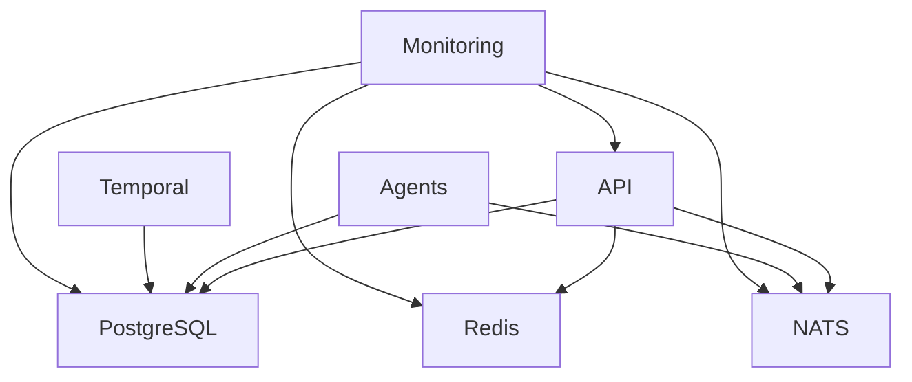

# 🔧 Multi-Agent Factory Operations Runbook

## 📊 System Overview

### Architecture Components
- **API Gateway**: FastAPI (Port 8000)
- **Message Bus**: NATS JetStream (Port 4222)
- **Database**: PostgreSQL with pgvector (Port 5432)
- **Cache**: Redis (Port 6379)
- **Orchestrator**: Temporal (Port 7233)
- **Monitoring**: Prometheus + Grafana (Ports 9090, 3000)

### Service Dependencies


## 🚀 Daily Operations

### Morning Health Check
```bash
#!/bin/bash
# Daily health check script

echo "=== Multi-Agent Factory Health Check ==="
echo "Date: $(date)"
echo

# Service status
echo "1. Service Status:"
make ps
echo

# API health
echo "2. API Health:"
curl -s http://localhost:8000/health | jq .
echo

# Database connections
echo "3. Database Status:"
make db-shell -c "SELECT count(*) as active_connections FROM pg_stat_activity WHERE state = 'active';"
echo

# Redis status
echo "4. Redis Status:"
make redis-cli info memory | grep used_memory_human
echo

# NATS status
echo "5. NATS Status:"
curl -s http://localhost:8222/varz | jq '.connections, .in_msgs, .out_msgs'
echo

# Queue depths
echo "6. Queue Depths:"
curl -s http://localhost:8222/jsz | jq '.streams[].state.messages'
echo

# Disk usage
echo "7. Disk Usage:"
df -h | grep -E "(Filesystem|/dev/)"
echo

echo "=== Health Check Complete ==="
```

### Performance Monitoring
```bash
# Check system resources
docker stats --no-stream

# Monitor API response times
curl -w "@curl-format.txt" -s -o /dev/null http://localhost:8000/health

# Check database performance
make db-shell -c "
  SELECT query, mean_exec_time, calls 
  FROM pg_stat_statements 
  ORDER BY mean_exec_time DESC 
  LIMIT 10;
"
```

## 🔄 Routine Maintenance

### Database Maintenance

#### Daily Tasks
```bash
# Update table statistics
make db-shell -c "ANALYZE;"

# Check for long-running queries
make db-shell -c "
  SELECT pid, now() - pg_stat_activity.query_start AS duration, query 
  FROM pg_stat_activity 
  WHERE (now() - pg_stat_activity.query_start) > interval '5 minutes';
"

# Monitor database size
make db-shell -c "
  SELECT pg_size_pretty(pg_database_size('multi_agent_factory')) as db_size;
"
```

#### Weekly Tasks
```bash
# Vacuum and reindex
make db-shell -c "VACUUM ANALYZE;"

# Check index usage
make db-shell -c "
  SELECT schemaname, tablename, indexname, idx_scan, idx_tup_read, idx_tup_fetch
  FROM pg_stat_user_indexes
  WHERE idx_scan = 0;
"

# Update extensions
make db-shell -c "ALTER EXTENSION pgvector UPDATE;"
```

### Cache Maintenance
```bash
# Redis memory optimization
make redis-cli MEMORY PURGE

# Check cache hit ratio
make redis-cli INFO stats | grep keyspace

# Monitor slow queries
make redis-cli SLOWLOG GET 10
```

### Message Queue Maintenance
```bash
# Check stream health
curl -s http://localhost:8222/jsz | jq '.streams[] | {name: .config.name, messages: .state.messages, bytes: .state.bytes}'

# Purge old messages (if needed)
curl -X DELETE "http://localhost:8222/jsz/streams/TASKS/messages?seq=1000"

# Monitor consumer lag
curl -s http://localhost:8222/jsz | jq '.streams[].consumer_detail[] | {name: .name, pending: .num_pending}'
```

## 📈 Scaling Operations

### Horizontal Scaling

#### Scale API Services
```bash
# Scale up API replicas
docker compose up --scale api=3

# Verify load distribution
for i in {1..10}; do curl -s http://localhost:8000/health | jq .hostname; done
```

#### Scale Agents
```bash
# Scale specific agent type
docker compose up --scale doc_writer=2 --scale backend_dev=3

# Monitor agent distribution
curl -s http://localhost:8222/jsz | jq '.streams[].consumer_detail[] | {name: .name, delivered: .delivered.consumer_seq}'
```

### Vertical Scaling
```yaml
# docker-compose.yml resource limits
services:
  api:
    deploy:
      resources:
        limits:
          cpus: '2.0'
          memory: 4G
        reservations:
          cpus: '1.0'
          memory: 2G
```

### Auto-scaling (Kubernetes)
```yaml
# k8s/hpa.yaml
apiVersion: autoscaling/v2
kind: HorizontalPodAutoscaler
metadata:
  name: maf-api-hpa
spec:
  scaleTargetRef:
    apiVersion: apps/v1
    kind: Deployment
    name: maf-api
  minReplicas: 2
  maxReplicas: 10
  metrics:
  - type: Resource
    resource:
      name: cpu
      target:
        type: Utilization
        averageUtilization: 70
  - type: Resource
    resource:
      name: memory
      target:
        type: Utilization
        averageUtilization: 80
```

## 💾 Backup and Recovery

### Database Backups

#### Automated Daily Backup
```bash
#!/bin/bash
# backup_db.sh

BACKUP_DIR="/backups/postgresql"
DATE=$(date +%Y%m%d_%H%M%S)
BACKUP_FILE="$BACKUP_DIR/maf_backup_$DATE.sql"

# Create backup directory
mkdir -p $BACKUP_DIR

# Perform backup
pg_dump -h localhost -U postgres -d multi_agent_factory > $BACKUP_FILE

# Compress backup
gzip $BACKUP_FILE

# Keep only last 7 days of backups
find $BACKUP_DIR -name "*.sql.gz" -mtime +7 -delete

echo "Backup completed: ${BACKUP_FILE}.gz"
```

#### Point-in-Time Recovery Setup
```bash
# Enable WAL archiving in postgresql.conf
wal_level = replica
archive_mode = on
archive_command = 'cp %p /backups/postgresql/wal/%f'
```

### Application State Backup
```bash
# Backup Redis data
redis-cli --rdb /backups/redis/dump_$(date +%Y%m%d).rdb

# Backup NATS JetStream
nats stream backup TASKS /backups/nats/tasks_$(date +%Y%m%d).backup
```

### Recovery Procedures

#### Database Recovery
```bash
# Stop application
make down

# Restore database
psql -h localhost -U postgres -d multi_agent_factory < /backups/postgresql/maf_backup_20250120.sql

# Start application
make up

# Verify data integrity
make test-agents
```

#### Full System Recovery
```bash
# 1. Restore infrastructure
docker compose down -v
docker compose up -d db redis nats

# 2. Restore data
./scripts/restore_backup.sh /backups/full_backup_20250120.tar.gz

# 3. Start services
make up

# 4. Verify functionality
./scripts/health_check.sh
```

## 🔍 Monitoring and Alerting

### Key Metrics

#### Application Metrics
- API response time (p50, p95, p99)
- Request rate (requests/second)
- Error rate (4xx, 5xx responses)
- Task completion rate
- Agent processing time

#### Infrastructure Metrics
- CPU utilization
- Memory usage
- Disk I/O
- Network throughput
- Database connections
- Queue depth

### Alert Thresholds
```yaml
# prometheus/alerts.yml
groups:
  - name: maf-alerts
    rules:
      - alert: HighAPILatency
        expr: histogram_quantile(0.95, rate(http_request_duration_seconds_bucket[5m])) > 0.5
        for: 2m
        labels:
          severity: warning
        annotations:
          summary: "High API latency detected"
      
      - alert: HighErrorRate
        expr: rate(http_requests_total{status=~"5.."}[5m]) > 0.1
        for: 1m
        labels:
          severity: critical
        annotations:
          summary: "High error rate detected"
      
      - alert: DatabaseConnectionsHigh
        expr: pg_stat_database_numbackends > 80
        for: 5m
        labels:
          severity: warning
        annotations:
          summary: "High number of database connections"
      
      - alert: QueueBacklog
        expr: nats_jetstream_stream_messages > 1000
        for: 5m
        labels:
          severity: warning
        annotations:
          summary: "Message queue backlog detected"
```

### Grafana Dashboards

#### System Overview Dashboard
```json
{
  "dashboard": {
    "title": "Multi-Agent Factory Overview",
    "panels": [
      {
        "title": "API Request Rate",
        "type": "graph",
        "targets": [
          {
            "expr": "rate(http_requests_total[5m])",
            "legendFormat": "{{method}} {{status}}"
          }
        ]
      },
      {
        "title": "Response Time",
        "type": "graph",
        "targets": [
          {
            "expr": "histogram_quantile(0.95, rate(http_request_duration_seconds_bucket[5m]))",
            "legendFormat": "95th percentile"
          }
        ]
      },
      {
        "title": "Active Tasks",
        "type": "stat",
        "targets": [
          {
            "expr": "sum(nats_jetstream_stream_messages)",
            "legendFormat": "Queued Tasks"
          }
        ]
      }
    ]
  }
}
```

## 🚨 Troubleshooting Guide

### Common Issues

#### API Returning 5xx Errors
```bash
# Check API logs
make logs S=api | tail -50

# Check database connectivity
make db-shell -c "SELECT 1;"

# Check Redis connectivity
make redis-cli ping

# Restart API service
docker compose restart api
```

#### Agents Not Processing Tasks
```bash
# Check NATS connectivity
curl http://localhost:8222/healthz

# Check agent logs
make logs S=doc_writer | tail -50

# Check queue status
curl -s http://localhost:8222/jsz | jq '.streams[].state'

# Restart agents
docker compose restart doc_writer backend_dev frontend_dev
```

#### Database Performance Issues
```bash
# Check active connections
make db-shell -c "SELECT count(*) FROM pg_stat_activity WHERE state = 'active';"

# Check slow queries
make db-shell -c "
  SELECT query, mean_exec_time, calls 
  FROM pg_stat_statements 
  ORDER BY mean_exec_time DESC 
  LIMIT 10;
"

# Check locks
make db-shell -c "SELECT * FROM pg_locks WHERE NOT granted;"
```

#### Memory Issues
```bash
# Check container memory usage
docker stats --no-stream

# Check system memory
free -h

# Clear Redis memory
make redis-cli FLUSHDB

# Restart memory-intensive services
docker compose restart api agents
```

### Performance Optimization

#### Database Optimization
```sql
-- Add missing indexes
CREATE INDEX CONCURRENTLY idx_tasks_status_created ON tasks(status, created_at);
CREATE INDEX CONCURRENTLY idx_results_task_id ON results(task_id);

-- Update statistics
ANALYZE;

-- Optimize queries
EXPLAIN ANALYZE SELECT * FROM tasks WHERE status = 'pending' ORDER BY created_at LIMIT 10;
```

#### Redis Optimization
```bash
# Configure memory policy
make redis-cli CONFIG SET maxmemory-policy allkeys-lru

# Enable compression
make redis-cli CONFIG SET rdbcompression yes
```

#### NATS Optimization
```yaml
# nats.conf
jetstream: {
  max_memory_store: 1GB
  max_file_store: 10GB
  store_dir: "/data/jetstream"
}
```

## 📋 Operational Checklists

### Pre-Deployment Checklist
- [ ] Run full test suite
- [ ] Verify database migrations
- [ ] Check configuration changes
- [ ] Backup current state
- [ ] Notify stakeholders
- [ ] Prepare rollback plan

### Post-Deployment Checklist
- [ ] Verify all services are running
- [ ] Check API health endpoints
- [ ] Test critical user journeys
- [ ] Monitor error rates
- [ ] Verify metrics collection
- [ ] Update documentation

### Weekly Maintenance Checklist
- [ ] Review system metrics
- [ ] Check backup integrity
- [ ] Update dependencies
- [ ] Review security logs
- [ ] Clean up old data
- [ ] Performance optimization review

### Monthly Review Checklist
- [ ] Capacity planning review
- [ ] Cost optimization analysis
- [ ] Security audit
- [ ] Disaster recovery testing
- [ ] Documentation updates
- [ ] Team training updates