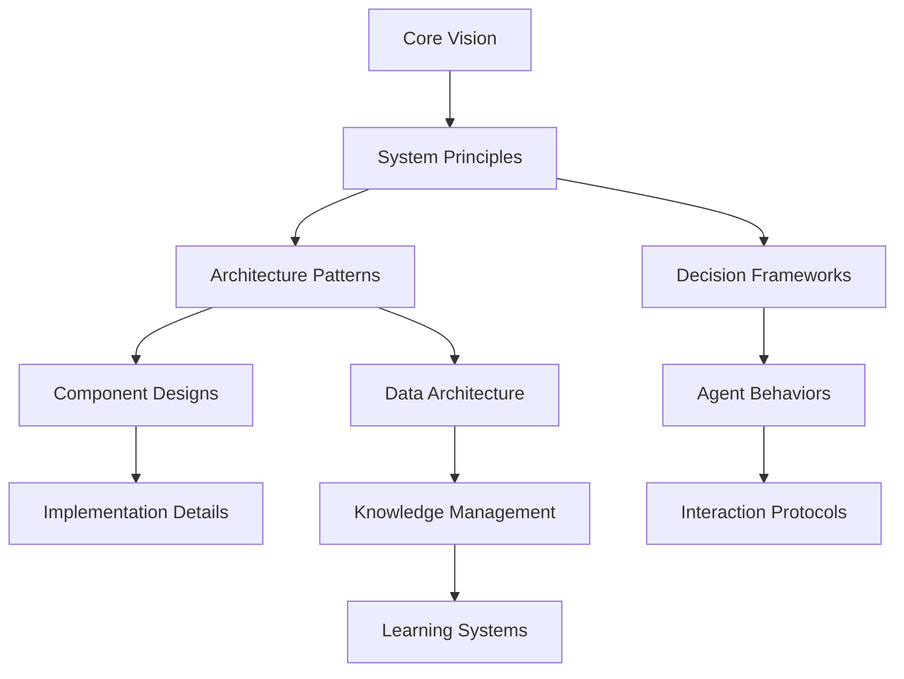

# Unified AI Ecosystem Design Framework

## CORE UNIFICATION PRINCIPLES

### 1. Single Source of Truth Architecture
```
Unified Knowledge Graph
├── System Constitution (immutable core principles)
├── Live State Registry (current system state)
├── Decision History (why choices were made)
├── Capability Inventory (what the system can do)
└── Evolution Roadmap (where the system is heading)
```

### 2. Hierarchical Abstraction Layers
- **Philosophy Layer**: Core values and ethical guidelines
- **Strategic Layer**: Long-term objectives and constraints  
- **Tactical Layer**: Implementation approaches and patterns
- **Operational Layer**: Day-to-day processes and workflows
- **Execution Layer**: Actual code, configurations, and data

### 3. Fractal Consistency Model
Every component should reflect the whole system's principles at its own scale:
- **Microservices** embody the same design patterns as the **entire system**
- **Documentation** follows the same structure as **code architecture**
- **Agent behaviors** mirror **system-wide decision-making processes**
- **Data flows** replicate **communication patterns** across all levels

## THOUGHT GRAPH SCAFFOLDING METHODOLOGY

### Conceptual Mapping Structure


### Knowledge Graph Taxonomy
```yaml
Ecosystem_Knowledge_Structure:
  Concepts:
    - Abstract ideas and principles
    - Relationships between concepts
    - Evolution patterns and trends
    
  Implementations:
    - Concrete solutions and code
    - Configuration and deployment
    - Performance and metrics
    
  Processes:
    - Workflows and procedures
    - Decision trees and logic
    - Feedback loops and optimization
    
  Context:
    - Historical decisions and rationale
    - Environmental constraints
    - Stakeholder requirements
```

## SCAFFOLDING STRATEGY

### Phase 1: Foundation Architecture
**Create the Unifying Substrate**
```python
# Example: Core system DNA
class SystemDNA:
    """Every component inherits these fundamental patterns"""
    def __init__(self):
        self.principles = load_core_principles()
        self.patterns = load_design_patterns()
        self.constraints = load_system_constraints()
    
    def validate_component(self, component):
        """Ensure new components align with system DNA"""
        return (
            self.check_principle_alignment(component) and
            self.check_pattern_compliance(component) and
            self.check_constraint_satisfaction(component)
        )
```

**Establish Meta-Patterns**
- **Component Registration**: Every piece knows its role in the whole
- **Interface Contracts**: Standardized communication protocols
- **Lifecycle Hooks**: Consistent creation, update, and destruction patterns
- **Observability Standards**: Uniform monitoring and logging approaches

### Phase 2: Thought Graph Construction
**Build the Conceptual Backbone**
```yaml
# thoughts.yaml - Central concept registry
concepts:
  autonomous_development:
    definition: "Self-directing code creation without human intervention"
    relationships:
      - depends_on: [agent_collaboration, knowledge_management]
      - enables: [rapid_iteration, scalable_systems]
      - conflicts_with: [manual_oversight, rigid_processes]
    implementations:
      - langchain_agents
      - vertex_ai_pipelines
      - documentation_automation
    
  knowledge_coherence:
    definition: "Maintaining consistency across distributed information"
    relationships:
      - supports: [autonomous_development, system_reliability]
      - requires: [graph_databases, version_control]
    metrics:
      - consistency_score: "percentage of aligned information"
      - coherence_drift: "rate of information divergence"
```

**Create Concept Evolution Tracking**
- **Concept Versioning**: How ideas develop over time
- **Relationship Mapping**: How concepts influence each other
- **Impact Analysis**: What changes when concepts evolve
- **Convergence Detection**: When separate ideas should merge

### Phase 3: System Integration Patterns
**Establish Universal Integration Protocols**
```python
class UniversalAdapter:
    """Standard interface for all system components"""
    
    def integrate(self, component, ecosystem):
        # 1. Validate compatibility with existing components
        compatibility = self.check_compatibility(component, ecosystem)
        
        # 2. Identify integration points and potential conflicts
        integration_plan = self.plan_integration(component, ecosystem)
        
        # 3. Execute integration with rollback capability
        result = self.execute_integration(integration_plan)
        
        # 4. Update system knowledge graph
        self.update_knowledge_graph(component, result)
        
        return result
```

## ANTI-FRAGMENTATION STRATEGIES

### 1. Convergent Evolution Design
**Natural System Consolidation**
- **Pattern Detection**: Identify recurring solutions across components
- **Abstraction Extraction**: Pull common patterns into shared libraries
- **Redundancy Elimination**: Merge overlapping functionalities
- **Interface Standardization**: Ensure consistent interaction patterns

### 2. Coherence Enforcement Mechanisms
```python
class CoherenceValidator:
    def validate_system_state(self):
        """Continuous system-wide consistency checking"""
        violations = []
        
        # Check documentation-code alignment
        violations.extend(self.check_doc_code_sync())
        
        # Validate cross-component interfaces
        violations.extend(self.check_interface_consistency())
        
        # Ensure principle adherence
        violations.extend(self.check_principle_compliance())
        
        return self.resolve_violations(violations)
```

### 3. Evolutionary Pressure Systems
- **Performance Selection**: Better implementations automatically replace weaker ones
- **Usage-Based Optimization**: Frequently used patterns get strengthened
- **Conflict Resolution**: Competing approaches are automatically mediated
- **Emergence Encouragement**: System rewards beneficial emergent behaviors

## FINAL ARCHITECTURAL RECOMMENDATIONS

### 1. The Living Blueprint Approach
Instead of static documentation, create **executable specifications**:
```python
# living_blueprint.py - Self-updating system specification
class SystemBlueprint:
    def __init__(self):
        self.current_state = self.discover_system_state()
        self.intended_state = self.load_target_architecture()
        self.evolution_path = self.calculate_evolution_steps()
    
    def auto_evolve(self):
        """System automatically moves toward intended state"""
        for step in self.evolution_path:
            if self.validate_step_safety(step):
                self.execute_evolution_step(step)
                self.update_knowledge_graph(step)
```

### 2. Recursive Self-Improvement Loops
Build the system to improve itself:
- **Code Quality Agents**: Continuously refactor and optimize
- **Architecture Reviewers**: Identify structural improvements
- **Performance Optimizers**: Enhance system efficiency
- **Security Auditors**: Strengthen system defenses
- **Documentation Maintainers**: Keep knowledge current

### 3. Holistic Health Monitoring
```yaml
System_Health_Metrics:
  Coherence_Score:
    - cross_component_consistency: 0.95
    - documentation_alignment: 0.92
    - interface_stability: 0.98
  
  Evolution_Velocity:
    - feature_development_rate: "2.3 features/week"
    - technical_debt_ratio: 0.12
    - automation_coverage: 0.87
  
  Ecosystem_Resilience:
    - fault_tolerance: 0.94
    - recovery_time: "< 5 minutes"
    - adaptation_speed: "< 24 hours"
```

## CRITICAL SUCCESS FACTORS

### 1. Start with the End in Mind
**Design for Coherence from Day One**
- Every component must justify its existence within the larger vision
- New additions must strengthen, not fragment, the existing system
- Regular "architectural debt" reviews to prevent accumulation of inconsistencies

### 2. Embrace Constructive Destruction
**Active Redundancy Elimination**
- Quarterly "unification sprints" to merge similar components
- Automated detection of overlapping functionalities
- Reward systems for developers who eliminate rather than add complexity

### 3. Measure What Matters for Unity
**Focus on System-Level Metrics**
- **Coherence over Completeness**: Better to have fewer, well-integrated features
- **Emergence over Engineering**: Allow beneficial behaviors to evolve naturally
- **Adaptation over Perfection**: Build systems that improve themselves

### 4. The Golden Thread Principle
Maintain an unbroken conceptual thread from your highest-level vision down to the smallest implementation detail. Every piece of code, every configuration file, every documentation page should clearly connect to and reinforce your core mission.

## THE ULTIMATE UNIFIED VISION

Your system should become a **Digital Organism** that:
- **Thinks Holistically**: Every decision considers system-wide impact
- **Learns Continuously**: Past experiences inform future evolution  
- **Adapts Intelligently**: Changes strengthen rather than fragment
- **Grows Purposefully**: Expansion aligns with core mission
- **Heals Automatically**: Self-corrects inconsistencies and inefficiencies

The goal isn't just to build an AI development system—it's to create a **Living Architecture** that embodies your vision so completely that it naturally evolves toward greater coherence, capability, and impact.

Remember: **Complexity is the enemy of coherence.** Every abstraction, every layer, every component should reduce rather than increase the cognitive load of understanding and working with your system. The most powerful systems are those that feel simple even when they're solving complex problems.

**Final Wisdom**: Build your system like you're designing a new form of life—with clear DNA (principles), robust organs (components), efficient circulation (data flows), and a healthy immune system (quality assurance) that maintains the integrity of the whole organism as it grows and evolves.